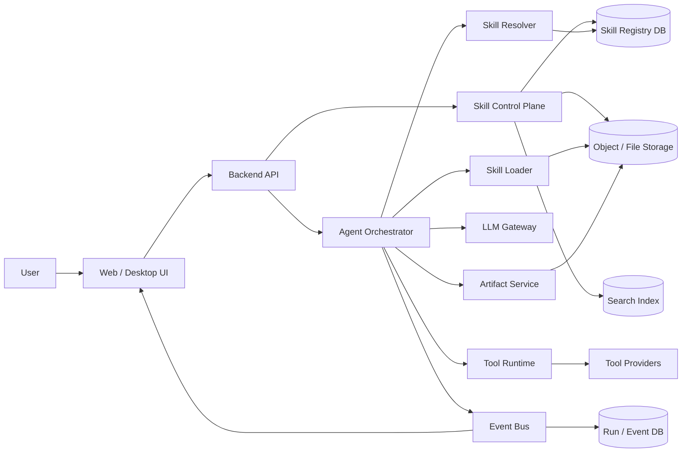
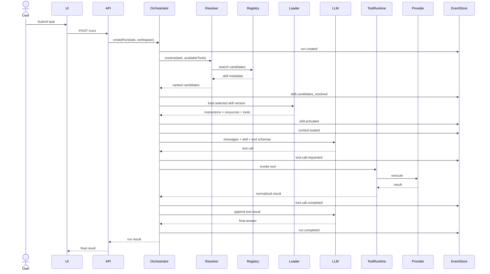
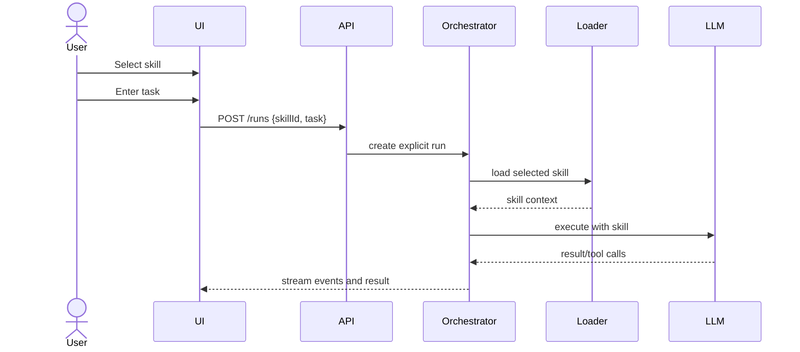
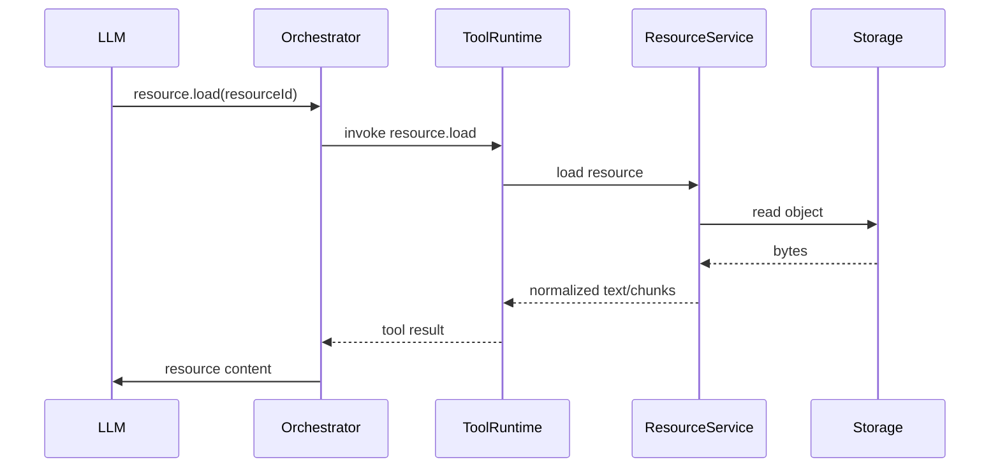
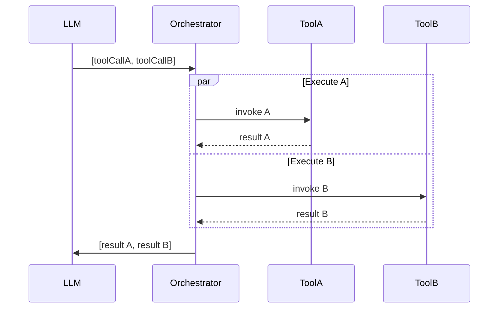
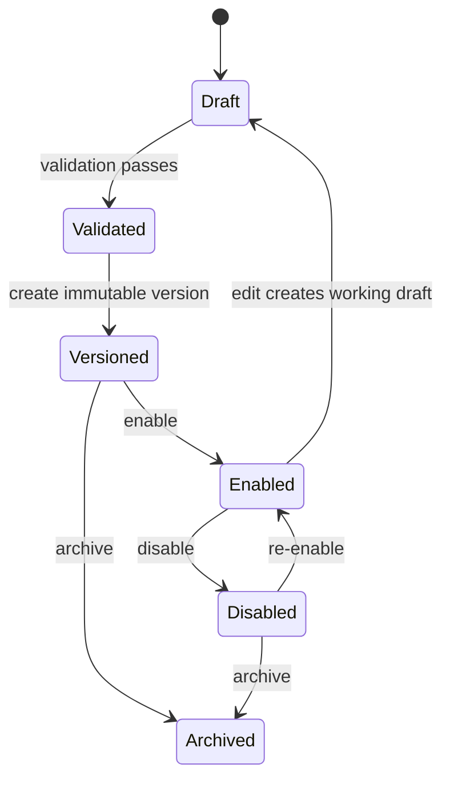

# Technical Specification: General-Purpose Agent Skills Platform

**Status:** Draft  
**Scope:** Skill authoring, registration, discovery, activation, execution, tool integration, UI, backend, schemas, lifecycle, testing, and observability  
**Out of scope:** Marketplace, billing, public publishing, trust scoring, signing, and security hardening  
**Reference model:** Agent Skills / `SKILL.md` progressive-disclosure pattern

---

## 1. Purpose

This document defines a general technical architecture for a platform that can create, manage, load, execute, test, and observe reusable LLM agent skills.

A **skill** is a portable capability package that contains:

1. Metadata used for discovery and activation.
2. Procedural instructions used by an LLM agent.
3. Optional reference documents.
4. Optional deterministic scripts.
5. Optional static assets and templates.
6. Tool requirements and tool-call contracts.
7. Test cases and evaluation scenarios.
8. Runtime configuration.

The platform is designed without marketplace concerns. Skills are assumed to be private, local, workspace-scoped, or organization-scoped.

The primary product flows are:

- Create a skill.
- Edit its instructions and resources.
- Declare the tools it needs.
- Validate its structure.
- Test whether it triggers correctly.
- Run it against a user task.
- Observe the execution sequence.
- Inspect tool calls, intermediate state, and final output.
- Version the skill.
- Enable or disable it in a workspace.

---

## 2. Design Principles

### 2.1 Skill is not a tool

A skill and a tool have different roles.

```text
Skill:
- Describes when and how to perform a task.
- Provides workflow, constraints, references, and output expectations.
- Is primarily consumed as context by the model.

Tool:
- Performs a concrete operation.
- Has a typed input schema.
- Produces a typed or semi-typed result.
- Is executed by the runtime, not interpreted as prose.
```

Example:

```text
Skill: github-pr-review
Tool: github.get_pull_request
Tool: github.get_diff
Tool: github.create_review_comment
```

The skill determines the review sequence. The tools provide access to GitHub operations.

### 2.2 Progressive disclosure

The runtime should not inject every file from every skill into the model context.

Recommended loading stages:

```text
Stage 1 — Discovery metadata
Load:
- skill id
- name
- description
- tags
- compatibility
- tool requirements

Stage 2 — Skill activation
Load:
- full SKILL.md body
- runtime variables
- relevant user/task context

Stage 3 — Resource loading
Load only when requested:
- references/*
- assets/*
- examples/*
- schemas/*

Stage 4 — Script execution
Execute scripts only when the workflow calls for them.
```

### 2.3 Deterministic operations should be executable

Use prose for judgment and workflow. Use scripts or tools for deterministic work.

Good candidates for scripts:

- Parsing.
- Validation.
- File conversion.
- Data normalization.
- Formula calculation.
- Schema checking.
- Code generation from a stable template.
- Packaging.
- Result comparison.

### 2.4 Runtime is event-driven

Every relevant execution action should emit an event:

```text
run.created
skill.candidates_resolved
skill.activated
context.loaded
model.requested
model.responded
tool.call.requested
tool.call.started
tool.call.completed
tool.call.failed
resource.loaded
script.started
script.completed
run.completed
run.failed
```

This event stream becomes the primary source for:

- UI updates.
- Debugging.
- Replay.
- Metrics.
- Audit-like inspection.
- Evaluation.

### 2.5 Schemas before implementation-specific payloads

The platform should have canonical internal schemas for:

- Skill manifest.
- Tool definition.
- Tool call.
- Tool result.
- Run.
- Message.
- Artifact.
- Resource.
- Event.
- Evaluation case.

Provider-specific formats should be adapted at the edges.

---

## 3. Terminology

| Term | Definition |
|---|---|
| Agent | LLM-based runtime that interprets tasks, loads skills, and invokes tools |
| Skill | Reusable procedural capability package |
| Tool | Typed callable operation exposed to the agent |
| Tool provider | Backend integration that implements one or more tools |
| Resource | Non-executable file loaded as context |
| Script | Executable code bundled with a skill |
| Workspace | Logical boundary containing skills, configurations, and runs |
| Skill registry | Searchable metadata index of installed skills |
| Skill resolver | Component that selects candidate skills for a task |
| Skill loader | Component that loads skill instructions and resources |
| Orchestrator | Component controlling the full run lifecycle |
| Run | One execution of a user task |
| Step | A unit within a run, such as an LLM turn or tool call |
| Artifact | A file or structured output produced by a run |
| Eval | Repeatable test measuring trigger or output behavior |
| Connector | Integration layer for an external application or service |
| Runtime profile | Model, token, timeout, and tool configuration used for a run |

---

## 4. System Context



The system is divided into:

### Control plane

Responsible for:

- Skill CRUD.
- Versioning.
- Validation.
- Tool catalog management.
- Workspace configuration.
- Runtime profiles.
- Evaluation definitions.
- Enable/disable state.

### Runtime plane

Responsible for:

- Creating runs.
- Selecting skills.
- Loading context.
- Calling the model.
- Dispatching tools.
- Executing scripts.
- Streaming events.
- Storing run state and artifacts.

---

## 5. Recommended Repository Structure

### 5.1 Monorepo

```text
agent-skills-platform/
├── apps/
│   ├── web/
│   ├── api/
│   ├── worker/
│   └── cli/
│
├── packages/
│   ├── skill-core/
│   ├── skill-parser/
│   ├── skill-validator/
│   ├── skill-resolver/
│   ├── agent-runtime/
│   ├── tool-runtime/
│   ├── tool-sdk/
│   ├── event-schema/
│   ├── llm-gateway/
│   └── ui-components/
│
├── skills/
│   ├── skills_research/
│   ├── skills_github/
│   └── skills_document/
│
├── tool-providers/
│   ├── filesystem/
│   ├── shell/
│   ├── web/
│   ├── github/
│   └── database/
│
├── schemas/
│   ├── skill.schema.json
│   ├── tool.schema.json
│   ├── run.schema.json
│   ├── event.schema.json
│   └── eval.schema.json
│
├── migrations/
├── tests/
│   ├── integration/
│   ├── e2e/
│   └── fixtures/
├── docs/
└── infra/
```

### 5.2 Individual skill package

```text
skills_example/
├── SKILL.md
├── skill.yaml
├── tools.yaml
├── runtime.yaml
├── references/
│   ├── domain-rules.md
│   ├── workflow-details.md
│   └── api-notes.md
├── scripts/
│   ├── main.py
│   ├── validate_input.py
│   └── requirements.txt
├── schemas/
│   ├── input.schema.json
│   └── output.schema.json
├── assets/
│   ├── templates/
│   └── examples/
├── evals/
│   ├── activation.yaml
│   ├── behavior.yaml
│   └── fixtures/
├── tests/
│   └── test_scripts.py
└── README.md
```

`SKILL.md` is the portable entry point. The additional YAML files are platform extensions that provide typed configuration.

---

## 6. Skill Package Contract

## 6.1 `SKILL.md`

Minimum form:

```markdown
---
name: data-analysis
description: Analyze tabular datasets, calculate metrics, identify anomalies, and produce findings. Use for CSV, spreadsheet, SQL-result, and structured-data analysis tasks.
---

# Data Analysis

## Objective

Analyze structured data and return verifiable findings.

## Workflow

1. Identify the input source and expected output.
2. Inspect columns, types, nulls, and row count.
3. Validate assumptions.
4. Perform the required analysis.
5. Verify calculations.
6. Present findings and limitations.

## Tool Usage

Use `data.inspect` before running aggregations.
Use `data.query` for deterministic transformations.
Use `artifact.create` for generated files.

## Output

Return:
- result summary;
- calculations;
- assumptions;
- generated artifacts.
```

### Required frontmatter

```yaml
name: string
description: string
```

### Recommended frontmatter

```yaml
name: data-analysis
description: Analyze structured datasets...
license: Proprietary
compatibility: Requires data inspection and query tools
metadata:
  author: internal-platform-team
  version: "1.0.0"
  category: data
  language: en
allowed-tools:
  - data.inspect
  - data.query
  - artifact.create
```

The canonical specification uses a directory with at least `SKILL.md`, and supports optional scripts, references, and assets. The `name` and `description` metadata are central to discovery and activation. See the references section.

## 6.2 `skill.yaml`

`skill.yaml` is the platform's canonical machine-readable manifest.

```yaml
apiVersion: skills.platform/v1
kind: Skill

metadata:
  id: skl_01JXYZ123
  slug: data-analysis
  displayName: Data Analysis
  version: 1.2.0
  description: Analyze structured datasets and produce verified findings.
  tags:
    - data
    - analytics
    - csv
    - spreadsheet

spec:
  entrypoint: SKILL.md
  status: enabled

  activation:
    mode: automatic
    priority: 50
    examples:
      positive:
        - Analyze this CSV and identify revenue anomalies.
        - Compare conversion rates by acquisition channel.
      negative:
        - Write a poem about data.

  resources:
    references:
      - references/domain-rules.md
      - references/workflow-details.md
    assets:
      - assets/templates/report.md
    schemas:
      input: schemas/input.schema.json
      output: schemas/output.schema.json

  tools:
    manifest: tools.yaml

  runtime:
    manifest: runtime.yaml

  evals:
    activation: evals/activation.yaml
    behavior: evals/behavior.yaml
```

## 6.3 `tools.yaml`

```yaml
apiVersion: skills.platform/v1
kind: ToolRequirements

required:
  - name: data.inspect
    version: ">=1.0.0"
    purpose: Inspect dataset metadata and quality.

  - name: data.query
    version: ">=1.1.0"
    purpose: Execute deterministic dataset transformations.

optional:
  - name: artifact.create
    version: ">=1.0.0"
    purpose: Create downloadable reports or result files.

aliases:
  inspect_dataset: data.inspect
  query_dataset: data.query
```

## 6.4 `runtime.yaml`

```yaml
apiVersion: skills.platform/v1
kind: SkillRuntime

model:
  profile: balanced
  temperature: 0.2
  maxOutputTokens: 8000

context:
  maxSkillTokens: 5000
  maxReferenceTokens: 20000
  resourceLoadMode: on-demand

execution:
  maxSteps: 30
  maxToolCalls: 20
  runTimeoutMs: 300000
  toolTimeoutMs: 60000

behavior:
  requirePlan: false
  allowParallelTools: true
  requireFinalResponse: true
```

---

## 7. Canonical Skill Schema

A JSON Schema representation can be used for API validation.

```json
{
  "$schema": "https://json-schema.org/draft/2020-12/schema",
  "$id": "https://example.internal/schemas/skill.schema.json",
  "title": "Skill",
  "type": "object",
  "required": ["apiVersion", "kind", "metadata", "spec"],
  "properties": {
    "apiVersion": {
      "const": "skills.platform/v1"
    },
    "kind": {
      "const": "Skill"
    },
    "metadata": {
      "type": "object",
      "required": ["slug", "displayName", "version", "description"],
      "properties": {
        "id": {
          "type": "string"
        },
        "slug": {
          "type": "string",
          "pattern": "^[a-z0-9]+(?:-[a-z0-9]+)*$"
        },
        "displayName": {
          "type": "string",
          "minLength": 1
        },
        "version": {
          "type": "string"
        },
        "description": {
          "type": "string",
          "minLength": 1,
          "maxLength": 1024
        },
        "tags": {
          "type": "array",
          "items": {
            "type": "string"
          },
          "uniqueItems": true
        }
      },
      "additionalProperties": false
    },
    "spec": {
      "type": "object",
      "required": ["entrypoint", "status", "activation"],
      "properties": {
        "entrypoint": {
          "type": "string",
          "const": "SKILL.md"
        },
        "status": {
          "enum": ["draft", "enabled", "disabled", "archived"]
        },
        "activation": {
          "$ref": "#/$defs/activation"
        },
        "resources": {
          "$ref": "#/$defs/resources"
        },
        "tools": {
          "type": "object",
          "properties": {
            "manifest": {
              "type": "string"
            }
          },
          "additionalProperties": false
        },
        "runtime": {
          "type": "object",
          "properties": {
            "manifest": {
              "type": "string"
            }
          },
          "additionalProperties": false
        }
      },
      "additionalProperties": false
    }
  },
  "$defs": {
    "activation": {
      "type": "object",
      "required": ["mode"],
      "properties": {
        "mode": {
          "enum": ["automatic", "manual", "hybrid"]
        },
        "priority": {
          "type": "integer",
          "minimum": 0,
          "maximum": 100
        },
        "examples": {
          "type": "object",
          "properties": {
            "positive": {
              "type": "array",
              "items": {
                "type": "string"
              }
            },
            "negative": {
              "type": "array",
              "items": {
                "type": "string"
              }
            }
          }
        }
      }
    },
    "resources": {
      "type": "object",
      "properties": {
        "references": {
          "type": "array",
          "items": {
            "type": "string"
          }
        },
        "assets": {
          "type": "array",
          "items": {
            "type": "string"
          }
        },
        "schemas": {
          "type": "object",
          "properties": {
            "input": {
              "type": "string"
            },
            "output": {
              "type": "string"
            }
          }
        }
      }
    }
  }
}
```

---

## 8. Tool Model

## 8.1 Tool definition

A tool is a typed function exposed to the agent runtime.

```json
{
  "name": "data.query",
  "version": "1.2.0",
  "title": "Query Dataset",
  "description": "Execute a deterministic query against a registered dataset.",
  "provider": "data-service",
  "inputSchema": {
    "type": "object",
    "required": ["datasetId", "operation"],
    "properties": {
      "datasetId": {
        "type": "string"
      },
      "operation": {
        "type": "string",
        "enum": ["select", "aggregate", "group", "sort", "filter"]
      },
      "columns": {
        "type": "array",
        "items": {
          "type": "string"
        }
      },
      "filters": {
        "type": "array",
        "items": {
          "$ref": "#/$defs/filter"
        }
      },
      "groupBy": {
        "type": "array",
        "items": {
          "type": "string"
        }
      },
      "limit": {
        "type": "integer",
        "minimum": 1,
        "maximum": 10000
      }
    },
    "$defs": {
      "filter": {
        "type": "object",
        "required": ["column", "operator", "value"],
        "properties": {
          "column": {
            "type": "string"
          },
          "operator": {
            "enum": ["eq", "ne", "gt", "gte", "lt", "lte", "in", "contains"]
          },
          "value": {}
        }
      }
    }
  },
  "outputSchema": {
    "type": "object",
    "required": ["columns", "rows", "rowCount"],
    "properties": {
      "columns": {
        "type": "array",
        "items": {
          "type": "string"
        }
      },
      "rows": {
        "type": "array",
        "items": {
          "type": "array"
        }
      },
      "rowCount": {
        "type": "integer"
      },
      "truncated": {
        "type": "boolean"
      }
    }
  },
  "execution": {
    "mode": "remote",
    "timeoutMs": 60000,
    "supportsStreaming": false,
    "supportsCancellation": true,
    "idempotency": "conditional"
  }
}
```

## 8.2 Canonical tool schema

```typescript
type ToolDefinition = {
  name: string;
  version: string;
  title: string;
  description: string;
  provider: string;

  inputSchema: JsonSchema;
  outputSchema?: JsonSchema;

  execution: {
    mode: "local" | "remote" | "builtin";
    timeoutMs: number;
    supportsStreaming: boolean;
    supportsCancellation: boolean;
    idempotency: "yes" | "no" | "conditional";
  };

  annotations?: {
    readOnly?: boolean;
    destructive?: boolean;
    externalSideEffect?: boolean;
    returnsArtifact?: boolean;
  };
};
```

Security behavior is outside this document, but annotations remain useful for UI rendering and workflow logic.

## 8.3 Tool call

```typescript
type ToolCall = {
  id: string;
  runId: string;
  stepId: string;

  tool: {
    name: string;
    version?: string;
  };

  arguments: Record<string, unknown>;

  state:
    | "requested"
    | "queued"
    | "running"
    | "succeeded"
    | "failed"
    | "cancelled"
    | "timed_out";

  requestedAt: string;
  startedAt?: string;
  completedAt?: string;
};
```

## 8.4 Tool result

```typescript
type ToolResult = {
  toolCallId: string;
  status: "success" | "error";

  content: Array<
    | {
        type: "text";
        text: string;
      }
    | {
        type: "json";
        data: unknown;
      }
    | {
        type: "artifact";
        artifactId: string;
        name: string;
        mimeType: string;
      }
    | {
        type: "resource";
        resourceId: string;
      }
  >;

  metadata?: {
    durationMs?: number;
    rowCount?: number;
    truncated?: boolean;
    nextCursor?: string;
  };

  error?: {
    code: string;
    message: string;
    retryable: boolean;
    details?: unknown;
  };
};
```

## 8.5 Tool naming convention

Use a stable namespace:

```text
<domain>.<verb>
```

Examples:

```text
filesystem.read
filesystem.write
filesystem.list
web.search
web.open
github.get_pull_request
github.create_comment
data.inspect
data.query
artifact.create
resource.load
script.execute
```

Avoid UI-oriented names such as:

```text
clickSubmitButton
openPopup
showResult
```

Tool names should express domain actions, not frontend implementation details.

---

## 9. Tool Provider Interface

A provider can implement one or more tools.

```typescript
interface ToolProvider {
  getManifest(): Promise<ToolProviderManifest>;

  listTools(): Promise<ToolDefinition[]>;

  invoke(
    request: ToolInvocationRequest,
    context: ToolExecutionContext
  ): Promise<ToolResult>;

  cancel?(toolCallId: string): Promise<void>;

  healthCheck?(): Promise<ProviderHealth>;
}
```

```typescript
type ToolInvocationRequest = {
  toolCallId: string;
  toolName: string;
  toolVersion?: string;
  arguments: Record<string, unknown>;
};

type ToolExecutionContext = {
  runId: string;
  stepId: string;
  workspaceId: string;
  userId?: string;
  deadline?: string;
  traceId: string;
};
```

Provider manifest:

```yaml
apiVersion: tools.platform/v1
kind: ToolProvider

metadata:
  name: data-service
  version: 1.4.0

spec:
  transport:
    type: http
    baseUrl: http://data-service.internal

  discovery:
    endpoint: /v1/tools

  invocation:
    endpoint: /v1/tool-calls

  health:
    endpoint: /health
```

Supported transports can include:

```text
- in-process
- HTTP
- gRPC
- worker queue
- subprocess
- MCP adapter
```

The internal runtime should normalize all transports into the same `ToolDefinition`, `ToolCall`, and `ToolResult` contracts.

---

## 10. Backend Components

## 10.1 API Gateway / Application API

Responsibilities:

- Authentication context.
- Workspace routing.
- Request validation.
- CRUD APIs.
- Run creation.
- Event streaming.
- Artifact download.
- UI-specific aggregation.

Suggested implementation:

```text
REST for CRUD and run commands
SSE or WebSocket for live run events
Object storage signed URL for artifacts
```

## 10.2 Skill Service

Responsibilities:

- Create skill.
- Import skill package.
- Parse `SKILL.md`.
- Manage metadata.
- Store files.
- Create versions.
- Enable or disable skill.
- Validate package.
- Return skill detail and file tree.

Core methods:

```typescript
interface SkillService {
  createSkill(input: CreateSkillInput): Promise<Skill>;
  importSkill(input: ImportSkillInput): Promise<Skill>;
  updateSkill(skillId: string, patch: SkillPatch): Promise<Skill>;
  createVersion(skillId: string, input: VersionInput): Promise<SkillVersion>;
  validateSkill(skillId: string): Promise<ValidationReport>;
  enableSkill(skillId: string): Promise<void>;
  disableSkill(skillId: string): Promise<void>;
  getSkill(skillId: string): Promise<Skill>;
  listSkills(query: SkillQuery): Promise<Page<SkillSummary>>;
  getFile(skillId: string, path: string): Promise<SkillFile>;
  putFile(skillId: string, path: string, content: Uint8Array): Promise<void>;
}
```

## 10.3 Skill Parser

Responsibilities:

- Read YAML frontmatter.
- Parse Markdown.
- Extract headings.
- Extract tool names mentioned in instructions.
- Extract resource links.
- Normalize metadata.
- Generate searchable text.
- Detect broken relative links.
- Produce a canonical parsed representation.

Canonical parsed result:

```typescript
type ParsedSkill = {
  frontmatter: {
    name: string;
    description: string;
    license?: string;
    compatibility?: string;
    metadata?: Record<string, string>;
    allowedTools?: string[];
  };

  markdown: {
    raw: string;
    plainText: string;
    headings: Array<{
      level: number;
      text: string;
      anchor: string;
    }>;
  };

  links: Array<{
    sourcePath: string;
    target: string;
    type: "reference" | "asset" | "external";
  }>;

  declaredToolNames: string[];
  tokenEstimate: number;
};
```

## 10.4 Skill Validator

Validation categories:

```text
STRUCTURE
- SKILL.md exists
- referenced files exist
- YAML is parseable

METADATA
- required fields exist
- slug format is valid
- description length is valid

TOOLS
- required tools exist in the tool catalog
- version constraints can be resolved
- input/output schemas are valid JSON Schema

RUNTIME
- limits are valid
- referenced model profile exists

SCHEMAS
- input schema compiles
- output schema compiles

EVALS
- evaluation files parse
- referenced fixtures exist
```

Validation result:

```typescript
type ValidationReport = {
  valid: boolean;
  checks: ValidationCheck[];
  generatedAt: string;
};

type ValidationCheck = {
  code: string;
  category: string;
  severity: "error" | "warning" | "info";
  path?: string;
  line?: number;
  message: string;
  suggestion?: string;
};
```

## 10.5 Skill Registry

The registry stores indexed metadata for fast discovery.

Searchable fields:

```text
- slug
- display name
- description
- tags
- status
- version
- tool requirements
- activation examples
- plain text extracted from SKILL.md
- workspace
```

Registry item:

```typescript
type SkillRegistryEntry = {
  skillId: string;
  workspaceId: string;
  versionId: string;
  slug: string;
  name: string;
  description: string;
  tags: string[];
  status: "enabled" | "disabled";
  activationMode: "automatic" | "manual" | "hybrid";
  priority: number;
  requiredTools: string[];
  embedding?: number[];
  updatedAt: string;
};
```

## 10.6 Skill Resolver

The resolver determines which skill or skills are relevant to a task.

Recommended pipeline:

```text
1. Filter enabled skills.
2. Filter by workspace and runtime compatibility.
3. Filter unavailable required tools.
4. Generate candidates using lexical search.
5. Generate candidates using semantic search.
6. Merge and rank.
7. Optionally ask an LLM classifier to rerank.
8. Apply threshold.
9. Return zero, one, or multiple candidates.
```

Resolver input:

```typescript
type ResolveSkillsInput = {
  workspaceId: string;
  task: string;
  conversationSummary?: string;
  explicitlySelectedSkillIds?: string[];
  availableTools: string[];
  maxCandidates?: number;
};
```

Resolver output:

```typescript
type SkillCandidate = {
  skillId: string;
  versionId: string;
  score: number;
  reasons: string[];
  sourceScores: {
    lexical?: number;
    semantic?: number;
    classifier?: number;
    explicit?: number;
  };
};
```

Suggested scoring:

```text
final_score =
  0.25 * lexical_score +
  0.35 * semantic_score +
  0.30 * classifier_score +
  0.10 * priority_score
```

For an explicitly selected skill:

```text
explicit_score = 1.0
activation decision = selected unless incompatible
```

## 10.7 Skill Loader

Responsibilities:

- Load the correct immutable skill version.
- Load `SKILL.md`.
- Resolve runtime variables.
- Prepare model-visible skill context.
- Expose resource descriptors.
- Load references on demand.
- Enforce context limits.
- Produce provenance metadata.

Loader output:

```typescript
type LoadedSkill = {
  skillId: string;
  versionId: string;
  name: string;
  description: string;

  instructions: {
    markdown: string;
    tokenEstimate: number;
  };

  availableResources: ResourceDescriptor[];
  requiredTools: ResolvedToolRequirement[];
  runtimeConfig: SkillRuntimeConfig;
};
```

## 10.8 Agent Orchestrator

The orchestrator is the central state machine.

Responsibilities:

- Create run.
- Resolve skill.
- Build context.
- Call model.
- Parse model tool calls.
- Dispatch tools.
- Append tool results.
- Repeat until completion.
- Store output.
- Emit events.
- Handle cancellation and timeout.

Suggested state machine:

```text
CREATED
  -> RESOLVING_SKILLS
  -> LOADING_CONTEXT
  -> MODEL_RUNNING
  -> TOOL_PENDING
  -> TOOL_RUNNING
  -> MODEL_RUNNING
  -> COMPLETED

Any state:
  -> FAILED
  -> CANCELLED
  -> TIMED_OUT
```

## 10.9 LLM Gateway

Responsibilities:

- Normalize provider APIs.
- Convert canonical messages and tools to provider-specific format.
- Stream tokens.
- Parse tool calls.
- Capture token usage.
- Apply model profile.
- Provide model fallback if configured.

Canonical request:

```typescript
type ModelRequest = {
  modelProfile: string;
  messages: AgentMessage[];
  tools: ToolDefinition[];
  responseFormat?: JsonSchema;
  temperature?: number;
  maxOutputTokens?: number;
  stream: boolean;
};
```

Canonical response:

```typescript
type ModelResponse = {
  id: string;
  finishReason:
    | "stop"
    | "tool_calls"
    | "length"
    | "content_filter"
    | "error";

  content: AgentContent[];
  toolCalls: ModelToolCall[];

  usage: {
    inputTokens: number;
    outputTokens: number;
    cachedTokens?: number;
  };
};
```

## 10.10 Tool Runtime

Responsibilities:

- Resolve tool provider.
- Validate arguments against input schema.
- Create tool-call record.
- Execute provider call.
- Track timeout.
- Normalize output.
- Validate output if an output schema exists.
- Emit lifecycle events.
- Return result to orchestrator.

Tool runtime sequence:

```text
model emits tool call
  -> locate tool definition
  -> validate arguments
  -> create tool_call row
  -> emit tool.call.requested
  -> invoke provider
  -> stream progress events if available
  -> normalize result
  -> validate output
  -> persist result
  -> emit tool.call.completed
  -> append result to model conversation
```

## 10.11 Script Runtime

Scripts are skill-bundled executables.

Suggested canonical tool:

```text
script.execute
```

Input:

```json
{
  "skillId": "skl_123",
  "versionId": "ver_456",
  "script": "scripts/main.py",
  "arguments": ["--input", "/workspace/input.json"],
  "environment": {
    "OUTPUT_PATH": "/workspace/output.json"
  },
  "timeoutMs": 60000
}
```

Result:

```json
{
  "exitCode": 0,
  "stdout": "completed",
  "stderr": "",
  "artifacts": [
    {
      "path": "/workspace/output.json",
      "mimeType": "application/json"
    }
  ]
}
```

For a general first implementation, script execution may be implemented through an isolated worker process. Detailed hardening is outside scope.

## 10.12 Resource Service

Responsibilities:

- List skill resources.
- Read file metadata.
- Load text resources.
- Extract text from supported documents.
- Chunk large files.
- Return model-ready text.
- Maintain source path and line information.

Resource descriptor:

```typescript
type ResourceDescriptor = {
  id: string;
  skillId: string;
  versionId: string;
  path: string;
  name: string;
  mimeType: string;
  sizeBytes: number;
  tokenEstimate?: number;
  description?: string;
};
```

Canonical resource tool:

```text
resource.load
```

Input:

```json
{
  "resourceId": "res_123",
  "mode": "full",
  "startLine": 1,
  "endLine": 300
}
```

Output:

```json
{
  "resourceId": "res_123",
  "path": "references/api-notes.md",
  "content": "...",
  "lineRange": {
    "start": 1,
    "end": 300
  },
  "truncated": false
}
```

## 10.13 Artifact Service

Artifacts differ from resources:

```text
Resource = input or bundled supporting material.
Artifact = output produced during a run.
```

Artifact model:

```typescript
type Artifact = {
  id: string;
  runId: string;
  stepId?: string;

  name: string;
  path: string;
  mimeType: string;
  sizeBytes: number;

  storageKey: string;
  checksum?: string;

  createdAt: string;
};
```

Core operations:

```text
artifact.create
artifact.get
artifact.list
artifact.preview
artifact.download
```

## 10.14 Event Service

Events should be append-only from the runtime perspective.

Event schema:

```typescript
type RunEvent<T = unknown> = {
  id: string;
  sequence: number;
  type: string;

  runId: string;
  stepId?: string;
  toolCallId?: string;

  timestamp: string;
  traceId: string;

  payload: T;
};
```

Example:

```json
{
  "id": "evt_01JXYZ",
  "sequence": 14,
  "type": "tool.call.completed",
  "runId": "run_01JXYZ",
  "stepId": "step_05",
  "toolCallId": "tc_03",
  "timestamp": "2026-07-30T01:00:00+07:00",
  "traceId": "tr_01JXYZ",
  "payload": {
    "toolName": "data.inspect",
    "durationMs": 420,
    "status": "success"
  }
}
```

## 10.15 Evaluation Service

Evaluation types:

```text
Activation evaluation:
Does the resolver activate the correct skill?

Behavior evaluation:
Does the agent follow the expected workflow?

Tool-use evaluation:
Does the agent select and call the correct tools?

Output evaluation:
Does the final response satisfy structural and semantic criteria?

Regression evaluation:
Is the new skill version better than or equivalent to the previous version?
```

---

## 11. Data Model

A relational database is sufficient for the control plane and run metadata. Object storage should hold file contents and artifacts.

## 11.1 Core tables

```text
workspaces
users
workspace_members

skills
skill_versions
skill_files
skill_tags
skill_tool_requirements

tool_providers
tool_definitions
workspace_tool_bindings

runtime_profiles

runs
run_skills
run_steps
messages
tool_calls
tool_results
run_events
artifacts

eval_suites
eval_cases
eval_runs
eval_case_results
```

## 11.2 `skills`

```sql
CREATE TABLE skills (
    id                  UUID PRIMARY KEY,
    workspace_id        UUID NOT NULL,
    slug                VARCHAR(128) NOT NULL,
    display_name        VARCHAR(255) NOT NULL,
    description         TEXT NOT NULL,
    status              VARCHAR(32) NOT NULL,
    activation_mode     VARCHAR(32) NOT NULL,
    priority            INTEGER NOT NULL DEFAULT 50,
    current_version_id  UUID,
    created_at          TIMESTAMPTZ NOT NULL,
    updated_at          TIMESTAMPTZ NOT NULL,
    UNIQUE (workspace_id, slug)
);
```

## 11.3 `skill_versions`

```sql
CREATE TABLE skill_versions (
    id                UUID PRIMARY KEY,
    skill_id          UUID NOT NULL,
    version           VARCHAR(64) NOT NULL,
    manifest_json     JSONB NOT NULL,
    parsed_skill_json JSONB NOT NULL,
    storage_prefix    TEXT NOT NULL,
    content_hash      VARCHAR(128) NOT NULL,
    created_at        TIMESTAMPTZ NOT NULL,
    UNIQUE (skill_id, version)
);
```

## 11.4 `skill_files`

```sql
CREATE TABLE skill_files (
    id              UUID PRIMARY KEY,
    version_id      UUID NOT NULL,
    path            TEXT NOT NULL,
    mime_type       VARCHAR(255) NOT NULL,
    size_bytes      BIGINT NOT NULL,
    storage_key     TEXT NOT NULL,
    content_hash    VARCHAR(128) NOT NULL,
    token_estimate  INTEGER,
    created_at      TIMESTAMPTZ NOT NULL,
    UNIQUE (version_id, path)
);
```

## 11.5 `tool_definitions`

```sql
CREATE TABLE tool_definitions (
    id                 UUID PRIMARY KEY,
    provider_id        UUID NOT NULL,
    name               VARCHAR(255) NOT NULL,
    version            VARCHAR(64) NOT NULL,
    title              VARCHAR(255) NOT NULL,
    description        TEXT NOT NULL,
    input_schema       JSONB NOT NULL,
    output_schema      JSONB,
    execution_config   JSONB NOT NULL,
    annotations        JSONB,
    enabled            BOOLEAN NOT NULL DEFAULT TRUE,
    created_at         TIMESTAMPTZ NOT NULL,
    updated_at         TIMESTAMPTZ NOT NULL,
    UNIQUE (name, version)
);
```

## 11.6 `runs`

```sql
CREATE TABLE runs (
    id                 UUID PRIMARY KEY,
    workspace_id       UUID NOT NULL,
    user_id            UUID,
    state              VARCHAR(32) NOT NULL,
    task               TEXT NOT NULL,
    model_profile      VARCHAR(128) NOT NULL,
    selected_skill_id  UUID,
    selected_version_id UUID,
    started_at         TIMESTAMPTZ,
    completed_at       TIMESTAMPTZ,
    error_code         VARCHAR(128),
    error_message      TEXT,
    usage_json         JSONB,
    created_at         TIMESTAMPTZ NOT NULL
);
```

## 11.7 `run_steps`

```sql
CREATE TABLE run_steps (
    id              UUID PRIMARY KEY,
    run_id          UUID NOT NULL,
    sequence        INTEGER NOT NULL,
    type            VARCHAR(32) NOT NULL,
    state           VARCHAR(32) NOT NULL,
    input_json      JSONB,
    output_json     JSONB,
    started_at      TIMESTAMPTZ,
    completed_at    TIMESTAMPTZ,
    UNIQUE (run_id, sequence)
);
```

## 11.8 `messages`

```sql
CREATE TABLE messages (
    id              UUID PRIMARY KEY,
    run_id          UUID NOT NULL,
    step_id         UUID,
    sequence        INTEGER NOT NULL,
    role            VARCHAR(32) NOT NULL,
    content_json    JSONB NOT NULL,
    created_at      TIMESTAMPTZ NOT NULL,
    UNIQUE (run_id, sequence)
);
```

## 11.9 `tool_calls`

```sql
CREATE TABLE tool_calls (
    id                UUID PRIMARY KEY,
    run_id            UUID NOT NULL,
    step_id           UUID NOT NULL,
    tool_name         VARCHAR(255) NOT NULL,
    tool_version      VARCHAR(64),
    state             VARCHAR(32) NOT NULL,
    arguments_json    JSONB NOT NULL,
    result_json       JSONB,
    error_json        JSONB,
    requested_at      TIMESTAMPTZ NOT NULL,
    started_at        TIMESTAMPTZ,
    completed_at      TIMESTAMPTZ
);
```

## 11.10 `run_events`

```sql
CREATE TABLE run_events (
    id              UUID PRIMARY KEY,
    run_id          UUID NOT NULL,
    sequence        BIGINT NOT NULL,
    type            VARCHAR(128) NOT NULL,
    step_id         UUID,
    tool_call_id    UUID,
    payload_json    JSONB NOT NULL,
    trace_id        VARCHAR(128) NOT NULL,
    created_at      TIMESTAMPTZ NOT NULL,
    UNIQUE (run_id, sequence)
);
```

---

## 12. Core Runtime Sequence

## 12.1 Automatic skill activation



## 12.2 Manually selected skill



## 12.3 On-demand reference loading



## 12.4 Parallel tool execution

Parallel execution is valid when tool calls have no dependency.



The orchestrator should preserve the model's tool-call IDs and return results in a provider-compatible form.

---

## 13. Orchestrator Loop

Pseudo-code:

```typescript
async function executeRun(run: Run): Promise<RunResult> {
  await events.emit("run.created", { runId: run.id });

  const availableTools = await toolCatalog.listAvailable(run.workspaceId);

  const candidates = run.explicitSkillId
    ? await resolver.resolveExplicit(run.explicitSkillId, availableTools)
    : await resolver.resolve({
        workspaceId: run.workspaceId,
        task: run.task,
        availableTools: availableTools.map((tool) => tool.name),
      });

  await events.emit("skill.candidates_resolved", { candidates });

  const selected = selectCandidate(candidates);

  const loadedSkill = selected
    ? await loader.load(selected.skillId, selected.versionId)
    : undefined;

  if (loadedSkill) {
    await events.emit("skill.activated", {
      skillId: loadedSkill.skillId,
      versionId: loadedSkill.versionId,
    });
  }

  const conversation = await contextBuilder.build({
    task: run.task,
    skill: loadedSkill,
    conversationId: run.conversationId,
  });

  const resolvedTools = await toolCatalog.resolveForRun({
    workspaceId: run.workspaceId,
    skill: loadedSkill,
  });

  for (let step = 0; step < run.maxSteps; step++) {
    await events.emit("model.requested", { step });

    const response = await llmGateway.generate({
      modelProfile: run.modelProfile,
      messages: conversation.messages,
      tools: resolvedTools,
      stream: true,
    });

    await events.emit("model.responded", {
      step,
      finishReason: response.finishReason,
      usage: response.usage,
    });

    conversation.appendAssistant(response.content);

    if (response.toolCalls.length === 0) {
      const result = await finalizeRun(run, conversation, response);
      await events.emit("run.completed", {
        outputMessageId: result.outputMessageId,
      });
      return result;
    }

    const toolResults = await executeToolCalls({
      run,
      step,
      calls: response.toolCalls,
      allowParallel: loadedSkill?.runtimeConfig.allowParallelTools ?? false,
    });

    for (const result of toolResults) {
      conversation.appendToolResult(result);
    }
  }

  throw new MaxStepsExceededError(run.id);
}
```

---

## 14. Context Construction

The context builder should create a predictable hierarchy.

```text
1. Platform system instructions
2. Runtime behavior instructions
3. Activated skill instructions
4. Skill resource index
5. Available tool definitions
6. Conversation summary
7. Recent conversation messages
8. Current user task
```

Example conceptual prompt:

```text
[SYSTEM]
You are an agent operating in the Skills Platform.

[RUNTIME]
Follow tool schemas exactly.
Load references only when required.

[ACTIVE SKILL]
Name: data-analysis
Description: ...
Instructions:
<SKILL.md body>

[AVAILABLE RESOURCES]
- res_123 references/domain-rules.md
- res_124 references/workflow-details.md

[USER TASK]
Analyze the attached CSV and identify anomalies.
```

The exact provider payload may differ. Internally, the context should remain structured.

```typescript
type AgentMessage = {
  id: string;
  role: "system" | "developer" | "user" | "assistant" | "tool";
  content: AgentContent[];
};

type AgentContent =
  | { type: "text"; text: string }
  | { type: "resource_ref"; resourceId: string }
  | { type: "artifact_ref"; artifactId: string }
  | { type: "tool_call"; toolCall: ModelToolCall }
  | { type: "tool_result"; toolResult: ToolResult };
```

---

## 15. UI Requirements

The UI should support two major user personas:

```text
Skill author:
Creates and debugs skills.

Skill user/operator:
Selects or automatically uses skills to execute tasks.
```

An initial product can support both in one application.

## 15.1 Main navigation

Recommended navigation:

```text
- Skills
- Run
- Runs
- Tools
- Evaluations
- Runtime Profiles
- Settings
```

No marketplace tab is required.

## 15.2 Skills list page

Required components:

```text
Header:
- Page title
- Create skill button
- Import skill button

Filters:
- Search
- Status
- Tags
- Activation mode
- Required tool
- Updated date

Skill table/cards:
- Display name
- Slug
- Description
- Current version
- Status
- Activation mode
- Required tools
- Last updated
- Validation state

Row actions:
- Open
- Run
- Duplicate
- Enable/disable
- Archive
```

Suggested columns:

```text
Name | Status | Version | Activation | Tools | Validation | Updated
```

## 15.3 Create skill flow

Wizard steps:

```text
1. Basic information
2. Instructions
3. Tools
4. Resources
5. Runtime
6. Tests
7. Review
```

### Step 1 — Basic information

Fields:

```text
- Display name
- Slug
- Description
- Tags
- Activation mode
- Priority
- Positive trigger examples
- Negative trigger examples
```

### Step 2 — Instructions

Editor requirements:

```text
- Markdown editor
- Preview panel
- YAML frontmatter form/editor
- Heading outline
- Token estimate
- Broken-link indicators
- Insert workflow template
- Insert tool reference
- Insert resource link
```

Recommended split view:

```text
Left: file tree
Center: editor
Right: preview / validation / outline
```

### Step 3 — Tools

Required UI:

```text
- Search tool catalog
- Add required tool
- Add optional tool
- View tool description
- View input schema
- View output schema
- View provider and version
- Test tool invocation
- Map aliases
```

A tool schema form renderer should generate inputs from JSON Schema.

Example:

```text
Tool: data.query

[datasetId]  text field
[operation]  select
[columns]    multi-value field
[filters]    repeatable object editor
[limit]      number field

[Test Invoke]
```

### Step 4 — Resources

Required UI:

```text
- Upload file
- Create Markdown file
- Create JSON/YAML file
- Rename
- Move
- Delete
- Preview
- Token estimate
- Reference from SKILL.md
```

File tree:

```text
SKILL.md
skill.yaml
tools.yaml
runtime.yaml
references/
scripts/
schemas/
assets/
evals/
tests/
```

### Step 5 — Runtime

Fields:

```text
- Model profile
- Temperature
- Max output tokens
- Max skill tokens
- Max reference tokens
- Max steps
- Max tool calls
- Run timeout
- Tool timeout
- Parallel tools toggle
```

### Step 6 — Tests

Tabs:

```text
- Activation tests
- Behavior tests
- Tool tests
- Output tests
```

### Step 7 — Review

Show:

```text
- Metadata summary
- Instruction preview
- Required tools
- Resources
- Runtime profile
- Validation issues
- Test status
```

Actions:

```text
- Save draft
- Create version
- Enable
- Run test
```

## 15.4 Skill detail page

Suggested tabs:

```text
Overview
Files
Tools
Versions
Evaluations
Runs
Settings
```

### Overview

Show:

```text
- Status
- Version
- Description
- Tags
- Activation mode
- Required tools
- Validation status
- Usage count
- Success rate
- Average steps
- Average tool calls
- Recent runs
```

### Files

Provide a complete repository-style file browser and editor.

### Tools

Display resolved tool versions and whether each tool is currently available.

### Versions

Show:

```text
Version
Created at
Author
Content hash
Validation status
Evaluation result
Change summary
```

Version comparison should support:

```text
- SKILL.md diff
- manifest diff
- tools diff
- runtime diff
- resource file diff
```

## 15.5 Run playground

This is the primary debugging UI.

Layout:

```text
Left panel:
- Skill selector
- Runtime profile
- Input attachments/resources
- Run parameters

Center panel:
- Conversation
- Streaming response
- Tool call cards

Right panel:
- Timeline
- Context inspector
- State inspector
- Artifacts
```

Input controls:

```text
- Task textarea
- Automatic/manual skill mode
- Skill selector
- Model profile
- Attach resource
- Max steps override
- Start run
- Cancel run
```

Tool-call card:

```text
Header:
- Tool name
- State
- Duration

Tabs:
- Arguments
- Result
- Raw
- Events
```

Timeline example:

```text
00:00.000 Run created
00:00.031 Resolving skills
00:00.104 Selected data-analysis
00:00.126 Loaded SKILL.md
00:00.315 Model request #1
00:01.721 Tool call data.inspect
00:02.141 Tool completed
00:02.180 Model request #2
00:03.502 Tool call data.query
00:04.311 Tool completed
00:04.350 Model request #3
00:06.020 Run completed
```

## 15.6 Context inspector

This UI is important because context composition directly affects behavior.

Show sections:

```text
- System instructions
- Runtime instructions
- Skill instructions
- Loaded references
- Tool definitions
- Conversation summary
- Recent messages
- Estimated tokens
```

Provide:

```text
- Expand/collapse
- Search
- Copy
- Raw provider request
- Canonical request
```

## 15.7 Run detail page

Tabs:

```text
Output
Timeline
Messages
Tool calls
Context
Artifacts
Metrics
Raw events
```

Metrics:

```text
- Total duration
- Resolver duration
- Context build duration
- Model latency
- Tool latency
- Number of model calls
- Number of tool calls
- Input tokens
- Output tokens
- Skill tokens
- Reference tokens
```

## 15.8 Tools catalog page

Required list fields:

```text
- Name
- Version
- Provider
- Description
- Execution mode
- Availability
- Last health check
```

Tool detail tabs:

```text
Overview
Input schema
Output schema
Test console
Provider
Usage
```

The test console should be generated from JSON Schema and show raw request/result.

## 15.9 Evaluation UI

Evaluation suite page:

```text
- Suite name
- Skill version
- Baseline version
- Number of cases
- Run status
- Aggregate score
```

Case detail:

```text
- Input
- Expected skill
- Actual skill
- Expected tools
- Actual tools
- Expected output constraints
- Actual output
- Score
- Event timeline
```

Comparison:

```text
Current version vs previous version
Skill enabled vs skill disabled
Model profile A vs model profile B
```

---

## 16. API Specification

Base path:

```text
/api/v1
```

## 16.1 Skill endpoints

```http
POST   /skills
GET    /skills
GET    /skills/{skillId}
PATCH  /skills/{skillId}
DELETE /skills/{skillId}

POST   /skills/import
POST   /skills/{skillId}/validate
POST   /skills/{skillId}/enable
POST   /skills/{skillId}/disable

GET    /skills/{skillId}/files
GET    /skills/{skillId}/files/{path}
PUT    /skills/{skillId}/files/{path}
DELETE /skills/{skillId}/files/{path}

GET    /skills/{skillId}/versions
POST   /skills/{skillId}/versions
GET    /skills/{skillId}/versions/{versionId}
GET    /skills/{skillId}/versions/{versionId}/diff
```

Create skill request:

```json
{
  "workspaceId": "wsp_123",
  "slug": "data-analysis",
  "displayName": "Data Analysis",
  "description": "Analyze structured datasets.",
  "activationMode": "automatic",
  "priority": 50,
  "tags": ["data", "analytics"]
}
```

Response:

```json
{
  "id": "skl_123",
  "workspaceId": "wsp_123",
  "slug": "data-analysis",
  "displayName": "Data Analysis",
  "status": "draft",
  "currentVersion": null,
  "createdAt": "2026-07-30T01:00:00+07:00"
}
```

## 16.2 Tool endpoints

```http
GET  /tools
GET  /tools/{toolName}
GET  /tools/{toolName}/versions
POST /tools/{toolName}/test
GET  /tool-providers
GET  /tool-providers/{providerId}
POST /tool-providers/{providerId}/refresh
```

Test tool request:

```json
{
  "version": "1.2.0",
  "arguments": {
    "datasetId": "ds_123",
    "operation": "select",
    "columns": ["date", "revenue"],
    "limit": 100
  }
}
```

## 16.3 Run endpoints

```http
POST /runs
GET  /runs
GET  /runs/{runId}
POST /runs/{runId}/cancel
GET  /runs/{runId}/events
GET  /runs/{runId}/messages
GET  /runs/{runId}/tool-calls
GET  /runs/{runId}/artifacts
```

Create run:

```json
{
  "workspaceId": "wsp_123",
  "task": "Analyze this dataset and identify anomalies.",
  "skillSelection": {
    "mode": "automatic"
  },
  "modelProfile": "balanced",
  "attachments": [
    {
      "resourceId": "res_input_123"
    }
  ],
  "overrides": {
    "maxSteps": 20
  }
}
```

Manual skill selection:

```json
{
  "workspaceId": "wsp_123",
  "task": "Analyze this dataset.",
  "skillSelection": {
    "mode": "manual",
    "skillId": "skl_123",
    "versionId": "ver_456"
  },
  "modelProfile": "balanced"
}
```

Run response:

```json
{
  "id": "run_123",
  "state": "created",
  "eventsUrl": "/api/v1/runs/run_123/events",
  "createdAt": "2026-07-30T01:00:00+07:00"
}
```

## 16.4 Server-Sent Events

```http
GET /api/v1/runs/{runId}/events
Accept: text/event-stream
```

Example stream:

```text
id: 1
event: run.created
data: {"runId":"run_123"}

id: 2
event: skill.candidates_resolved
data: {"candidates":[{"skillId":"skl_123","score":0.92}]}

id: 3
event: skill.activated
data: {"skillId":"skl_123","versionId":"ver_456"}

id: 4
event: model.output.delta
data: {"text":"I will inspect the dataset..."}

id: 5
event: tool.call.started
data: {"toolCallId":"tc_1","toolName":"data.inspect"}
```

## 16.5 Evaluation endpoints

```http
POST /eval-suites
GET  /eval-suites
GET  /eval-suites/{suiteId}
POST /eval-suites/{suiteId}/runs
GET  /eval-runs/{evalRunId}
GET  /eval-runs/{evalRunId}/results
```

---

## 17. Evaluation Schemas

## 17.1 Activation cases

```yaml
apiVersion: skills.platform/v1
kind: ActivationEvalSuite

metadata:
  name: data-analysis-activation

spec:
  skill: data-analysis

  cases:
    - id: positive-001
      input: Analyze monthly revenue by region.
      expected:
        activated: true

    - id: positive-002
      input: Find anomalies in this CSV file.
      expected:
        activated: true

    - id: negative-001
      input: Draft a customer support email.
      expected:
        activated: false
```

## 17.2 Behavior cases

```yaml
apiVersion: skills.platform/v1
kind: BehaviorEvalSuite

metadata:
  name: data-analysis-behavior

spec:
  skill: data-analysis

  cases:
    - id: inspect-before-query
      input:
        task: Analyze the attached dataset.
        fixtures:
          - fixtures/sales.csv

      expected:
        toolSequence:
          - data.inspect
          - data.query

        output:
          contains:
            - findings
            - assumptions

          artifactTypes:
            - text/csv
```

## 17.3 Flexible assertions

```typescript
type EvalExpectation = {
  activation?: {
    skillId?: string;
    activated: boolean;
    minimumScore?: number;
  };

  tools?: {
    required?: string[];
    forbidden?: string[];
    exactSequence?: string[];
    partialOrder?: Array<[string, string]>;
    maxCalls?: number;
  };

  output?: {
    jsonSchema?: JsonSchema;
    contains?: string[];
    excludes?: string[];
    artifactTypes?: string[];
  };

  run?: {
    maxSteps?: number;
    maxDurationMs?: number;
  };
};
```

---

## 18. Skill Lifecycle



Recommended semantics:

### Draft

Mutable files and metadata.

### Validated

Current draft passes structural and configuration checks.

### Versioned

Immutable snapshot exists.

### Enabled

Current version can be selected automatically or manually.

### Disabled

Skill remains visible but cannot be activated for normal runs.

### Archived

Read-only historical state.

Editing an enabled skill should create or update a draft, not mutate the active immutable version.

---

## 19. Versioning

Use semantic versioning where practical:

```text
MAJOR:
Workflow or output contract changes incompatibly.

MINOR:
New capability, optional tool, or resource is added.

PATCH:
Instruction corrections, examples, or non-breaking fixes.
```

Immutable version package:

```text
skill_versions/{skillId}/{version}/
├── SKILL.md
├── skill.yaml
├── tools.yaml
├── runtime.yaml
└── ...
```

Each version should store:

```text
- semantic version
- content hash
- manifest snapshot
- parsed metadata
- file index
- creation timestamp
- change summary
- validation report
- evaluation report reference
```

---

## 20. Skill Composition

A general system may allow multiple skills in one run, but composition introduces context and workflow conflicts.

Recommended first implementation:

```text
- One primary skill per run.
- Zero or more utility skills later.
```

Future composition model:

```yaml
spec:
  composition:
    includes:
      - skill: citation-formatting
        mode: utility
      - skill: artifact-generation
        mode: utility
```

Possible precedence:

```text
1. Platform instructions
2. Primary skill
3. Utility skills ordered by priority
4. User task
```

Conflict handling:

```text
- Tool restrictions: intersection or explicit primary override.
- Output schema: primary skill owns final schema.
- Runtime limits: most restrictive or primary-owned.
- Duplicate resources: namespaced by skill.
```

---

## 21. Input and Output Contracts

Skills may optionally define input and output schemas.

Input schema:

```json
{
  "type": "object",
  "required": ["task"],
  "properties": {
    "task": {
      "type": "string"
    },
    "datasetId": {
      "type": "string"
    },
    "metrics": {
      "type": "array",
      "items": {
        "type": "string"
      }
    }
  }
}
```

Output schema:

```json
{
  "type": "object",
  "required": ["summary", "findings"],
  "properties": {
    "summary": {
      "type": "string"
    },
    "findings": {
      "type": "array",
      "items": {
        "type": "object",
        "required": ["title", "evidence"],
        "properties": {
          "title": {
            "type": "string"
          },
          "evidence": {
            "type": "string"
          },
          "severity": {
            "enum": ["info", "warning", "critical"]
          }
        }
      }
    },
    "artifacts": {
      "type": "array",
      "items": {
        "type": "string"
      }
    }
  }
}
```

Two output modes:

```text
Natural-language mode:
The final result is primarily text.

Structured mode:
The model must return JSON conforming to output schema.
```

UI should render structured output using schema-aware components and retain raw JSON.

---

## 22. Error Handling

Error taxonomy:

```text
SKILL_NOT_FOUND
SKILL_DISABLED
SKILL_VERSION_NOT_FOUND
SKILL_INVALID
SKILL_TOOL_UNAVAILABLE
SKILL_CONTEXT_LIMIT_EXCEEDED

TOOL_NOT_FOUND
TOOL_ARGUMENT_VALIDATION_FAILED
TOOL_OUTPUT_VALIDATION_FAILED
TOOL_PROVIDER_UNAVAILABLE
TOOL_TIMEOUT
TOOL_EXECUTION_FAILED

MODEL_PROVIDER_UNAVAILABLE
MODEL_TIMEOUT
MODEL_CONTEXT_LIMIT
MODEL_OUTPUT_INVALID

RUN_CANCELLED
RUN_TIMEOUT
RUN_MAX_STEPS_EXCEEDED
RUN_MAX_TOOL_CALLS_EXCEEDED

RESOURCE_NOT_FOUND
RESOURCE_UNSUPPORTED_TYPE
RESOURCE_PARSE_FAILED

ARTIFACT_CREATE_FAILED
```

Canonical error:

```typescript
type PlatformError = {
  code: string;
  message: string;
  retryable: boolean;

  source:
    | "skill"
    | "resolver"
    | "model"
    | "tool"
    | "resource"
    | "artifact"
    | "runtime";

  details?: unknown;
  traceId: string;
};
```

Runtime behavior:

```text
Retryable tool error:
- Retry according to provider/runtime policy.
- Return final error to model if retries are exhausted.

Argument validation error:
- Return validation details to model.
- Allow model to correct arguments.

Output validation error:
- Mark tool call failed.
- Return normalized validation error.

Model context limit:
- Rebuild context with summarization or reduced resources.
- Retry once if configured.

Max-step limit:
- Stop loop.
- Store partial output and run state.
```

---

## 23. Observability

## 23.1 Traces

One trace per run.

Recommended spans:

```text
run
├── resolve_skills
├── load_skill
├── build_context
├── model_call_1
├── tool_call_1
│   └── provider_request
├── model_call_2
└── finalize
```

Span attributes:

```text
run.id
workspace.id
skill.id
skill.version
model.profile
model.provider
tool.name
tool.version
step.sequence
token.input
token.output
duration.ms
status
```

## 23.2 Metrics

Skill metrics:

```text
skill_activation_count
skill_activation_success_rate
skill_no_match_rate
skill_average_resolver_score
skill_run_success_rate
skill_average_steps
skill_average_tool_calls
skill_average_duration_ms
skill_input_tokens
skill_output_tokens
skill_reference_load_count
```

Tool metrics:

```text
tool_call_count
tool_success_rate
tool_error_rate
tool_timeout_rate
tool_duration_ms
tool_argument_validation_error_count
tool_output_validation_error_count
```

Runtime metrics:

```text
run_count
run_success_rate
run_failure_rate
run_cancelled_rate
run_duration_ms
resolver_duration_ms
context_build_duration_ms
model_latency_ms
event_stream_lag_ms
```

## 23.3 Logs

Use structured logs:

```json
{
  "level": "info",
  "message": "tool call completed",
  "traceId": "tr_123",
  "runId": "run_123",
  "stepId": "step_4",
  "toolCallId": "tc_2",
  "toolName": "data.query",
  "durationMs": 810,
  "timestamp": "2026-07-30T01:00:00+07:00"
}
```

Do not rely on logs as the run state. Run state should remain in the database and event stream.

---

## 24. Caching

Useful cache layers:

### Skill metadata cache

Key:

```text
workspace:{workspaceId}:enabled-skills
```

Contains registry metadata for resolver candidate generation.

### Parsed skill cache

Key:

```text
skill-version:{versionId}:parsed
```

### Skill content cache

Key:

```text
skill-version:{versionId}:SKILL.md
```

### Tool definition cache

Key:

```text
tool:{name}:{version}
```

### Resource extraction cache

Key:

```text
resource:{contentHash}:extracted
```

### Embedding cache

Key:

```text
skill-version:{versionId}:embedding:{embeddingModelVersion}
```

Because versions are immutable, content-hash-based caching is straightforward.

---

## 25. Background Workers

Some operations should be asynchronous from the HTTP request lifecycle, although the platform UI can display their progress.

Worker jobs:

```text
- Parse imported skill package.
- Validate all files.
- Extract text from resources.
- Estimate tokens.
- Generate skill embeddings.
- Run evaluation suites.
- Package a version.
- Rebuild registry index.
- Execute long-running tools.
- Process artifacts.
```

Suggested queues:

```text
skill-processing
evaluation
run-execution
tool-execution
artifact-processing
indexing
```

Job schema:

```typescript
type Job = {
  id: string;
  type: string;
  workspaceId: string;
  payload: unknown;
  state: "queued" | "running" | "completed" | "failed";
  attempts: number;
  maxAttempts: number;
  createdAt: string;
  startedAt?: string;
  completedAt?: string;
};
```

---

## 26. Suggested Initial Technology Stack

This is one practical option, not a protocol requirement.

### Frontend

```text
- React or Next.js
- TypeScript
- Monaco Editor for Markdown/YAML/JSON/code
- JSON Schema form renderer
- Markdown preview renderer
- SSE client for run events
- Mermaid for sequence and workflow previews
```

### Backend API

```text
- TypeScript with Fastify/NestJS
  or
- Python with FastAPI

Core needs:
- REST
- SSE/WebSocket
- JSON Schema validation
- background-job integration
```

### Runtime workers

```text
- Python for data/document/script-heavy workloads
- TypeScript for orchestration and connector-heavy workloads
```

### Persistence

```text
- PostgreSQL for metadata and run state
- S3-compatible object storage for files and artifacts
- Redis for cache, locks, and queue coordination
- pgvector or separate vector index for semantic skill discovery
```

### Messaging

```text
Initial:
- PostgreSQL outbox + Redis queue

At scale:
- NATS, Kafka, or cloud-native queue/event bus
```

### Observability

```text
- OpenTelemetry
- Prometheus-compatible metrics
- Trace backend
- Structured log backend
```

---

## 27. Minimum Viable Product

The MVP should not attempt every advanced capability.

### MVP features

```text
Skill management:
- Create/edit skill
- SKILL.md editor
- skill.yaml editor/form
- references upload
- draft and immutable version
- enable/disable

Tool management:
- Static tool catalog
- JSON Schema input definition
- HTTP and in-process provider
- test invocation

Runtime:
- Manual skill selection
- Optional simple automatic resolver
- One active skill
- Sequential tool calls
- SSE event stream
- run cancellation
- final output storage

UI:
- Skills list
- Skill editor
- Tool catalog
- Run playground
- Run detail/timeline
- Basic evaluations

Backend:
- PostgreSQL
- object storage
- API service
- worker service
- LLM gateway
- tool runtime
```

### Exclude from MVP

```text
- Multi-skill composition
- Public marketplace
- Billing
- User-generated public distribution
- Complex workflow DAG editor
- Full visual no-code tool builder
- Multiple concurrent agents
- Long-term memory
- Automated skill generation
- Advanced policy engine
```

---

## 28. Suggested Delivery Phases

## Phase 1 — Skill package and editor

Deliver:

```text
- Skill schema
- SKILL.md parser
- file storage
- validation
- skill editor UI
- versioning
```

Acceptance criteria:

```text
A user can create a skill, add references, validate it, and create an immutable version.
```

## Phase 2 — Tool platform

Deliver:

```text
- Tool schema
- tool catalog
- provider interface
- HTTP provider
- in-process provider
- test console
```

Acceptance criteria:

```text
A user can register a typed tool and invoke it from the UI with schema validation.
```

## Phase 3 — Runtime

Deliver:

```text
- run API
- orchestrator loop
- LLM gateway
- manual skill activation
- tool dispatch
- event stream
- run timeline
```

Acceptance criteria:

```text
A selected skill can guide the model through one or more tool calls and produce a final result.
```

## Phase 4 — Resolver

Deliver:

```text
- registry index
- lexical search
- embeddings
- candidate scoring
- automatic activation
- resolver inspection UI
```

Acceptance criteria:

```text
The runtime can select an appropriate enabled skill from a user task with measurable activation tests.
```

## Phase 5 — Evaluations and quality

Deliver:

```text
- activation eval
- behavior eval
- tool sequence assertions
- baseline comparison
- evaluation dashboard
```

Acceptance criteria:

```text
A skill version can be compared against a previous version using repeatable cases.
```

## Phase 6 — Advanced runtime

Deliver:

```text
- reference loading tool
- artifact service
- script execution
- parallel tool calls
- output schemas
- richer observability
```

---

## 29. Example End-to-End Skill

Directory:

```text
skills_research/
├── SKILL.md
├── skill.yaml
├── tools.yaml
├── runtime.yaml
├── references/
│   ├── source-selection.md
│   └── report-format.md
├── schemas/
│   └── output.schema.json
└── evals/
    ├── activation.yaml
    └── behavior.yaml
```

### `SKILL.md`

```markdown
---
name: technical-research
description: Research technical topics, compare primary sources, extract implementation details, and produce a structured report with references. Use for architecture research, API comparison, standards, libraries, protocols, and engineering decisions.
---

# Technical Research

## Objective

Produce a technically precise report based on relevant primary sources.

## Workflow

1. Clarify the technical object and expected output.
2. Search for official specifications and primary documentation.
3. Read the most relevant sources.
4. Extract architecture, interfaces, schemas, constraints, and examples.
5. Resolve contradictions.
6. Organize findings into an implementation-oriented report.
7. Return references and identify unresolved gaps.

## Tools

Use `web.search` to discover sources.
Use `web.open` to read source content.
Use `resource.load` for bundled research conventions.
Use `artifact.create` when the requested output is a file.

## Resources

Read `references/source-selection.md` when selecting sources.
Read `references/report-format.md` before producing a long report.

## Output

Return:
- executive summary;
- architecture;
- components;
- sequence;
- schemas;
- implementation notes;
- references.
```

### `skill.yaml`

```yaml
apiVersion: skills.platform/v1
kind: Skill

metadata:
  slug: technical-research
  displayName: Technical Research
  version: 1.0.0
  description: Research technical topics and produce implementation-oriented reports.
  tags:
    - research
    - architecture
    - engineering

spec:
  entrypoint: SKILL.md
  status: enabled

  activation:
    mode: automatic
    priority: 60
    examples:
      positive:
        - Research the architecture of Agent Skills.
        - Compare the tool schemas used by agent runtimes.
      negative:
        - Rewrite this greeting message.

  resources:
    references:
      - references/source-selection.md
      - references/report-format.md
    schemas:
      output: schemas/output.schema.json

  tools:
    manifest: tools.yaml

  runtime:
    manifest: runtime.yaml
```

### `tools.yaml`

```yaml
apiVersion: skills.platform/v1
kind: ToolRequirements

required:
  - name: web.search
    version: ">=1.0.0"
    purpose: Discover technical sources.

  - name: web.open
    version: ">=1.0.0"
    purpose: Read technical sources.

optional:
  - name: resource.load
    version: ">=1.0.0"
    purpose: Load bundled guidance.

  - name: artifact.create
    version: ">=1.0.0"
    purpose: Create a Markdown report.
```

### `runtime.yaml`

```yaml
apiVersion: skills.platform/v1
kind: SkillRuntime

model:
  profile: reasoning
  temperature: 0.1
  maxOutputTokens: 12000

context:
  maxSkillTokens: 5000
  maxReferenceTokens: 30000
  resourceLoadMode: on-demand

execution:
  maxSteps: 40
  maxToolCalls: 30
  runTimeoutMs: 600000
  toolTimeoutMs: 90000

behavior:
  requirePlan: true
  allowParallelTools: true
  requireFinalResponse: true
```

---

## 30. Reference Architecture Summary

```text
UI
├── Skill Manager
├── Markdown/File Editor
├── Tool Catalog and Schema Console
├── Run Playground
├── Run Timeline and Context Inspector
└── Evaluation Dashboard

Backend Control Plane
├── Skill Service
├── Parser
├── Validator
├── Version Service
├── Registry
├── Tool Catalog
├── Runtime Profile Service
└── Evaluation Service

Backend Runtime Plane
├── Run Service
├── Skill Resolver
├── Skill Loader
├── Context Builder
├── Agent Orchestrator
├── LLM Gateway
├── Tool Runtime
├── Script Runtime
├── Resource Service
├── Artifact Service
└── Event Service

Storage
├── PostgreSQL
├── Object Storage
├── Cache
├── Queue/Event Bus
└── Vector Index
```

The critical implementation boundary is:

```text
Natural-language capability definition:
SKILL.md + references

Machine-readable skill configuration:
skill.yaml + tools.yaml + runtime.yaml

Executable operations:
tool providers + scripts

Execution control:
orchestrator + event stream

Authoring and debugging:
editor + playground + timeline + context inspector
```

---

## 31. Key Architectural Decisions

1. Use `SKILL.md` as the portable skill entry point.
2. Add typed platform manifests without replacing `SKILL.md`.
3. Keep tool definitions independent from skill packages.
4. Use JSON Schema for tool inputs, tool outputs, and optional skill I/O.
5. Store skill versions as immutable snapshots.
6. Use one primary skill per run for the initial implementation.
7. Use an event-driven orchestrator and persist run events.
8. Use SSE for simple live UI streaming.
9. Load references on demand rather than injecting all files.
10. Separate resources from generated artifacts.
11. Normalize all LLM providers behind one gateway.
12. Normalize all tool transports behind one tool runtime.
13. Treat evaluation as a first-class platform feature.
14. Build context inspection into the UI from the beginning.
15. Keep marketplace, billing, and public distribution outside the core.

---

## 32. References

The structural baseline in this document follows the open Agent Skills format, where a skill is a directory containing at minimum a `SKILL.md` file and may include `scripts/`, `references/`, and `assets/`. The official guidance also describes progressive disclosure and recommends keeping the primary instructions compact while loading detailed resources only when required.

- Agent Skills specification: https://agentskills.io/specification
- Agent Skills overview: https://agentskills.io/home
- Adding skill support to an agent: https://agentskills.io/client-implementation/adding-skills-support
- Skill creation best practices: https://agentskills.io/skill-creation/best-practices
- Using scripts in skills: https://agentskills.io/skill-creation/using-scripts
- Evaluating skills: https://agentskills.io/skill-creation/evaluating-skills
- SkillsLLM catalog reference: https://skillsllm.com/
- SkillsLLM SkillAnything example: https://skillsllm.com/skill/skillanything

SkillsLLM is used here as a catalog of real-world patterns rather than the normative package specification. The normative structural reference is the Agent Skills specification.
