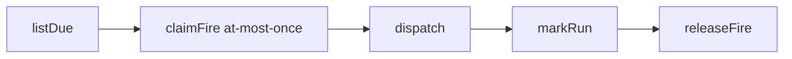

# Job Automation Waist

Scheduled and event-triggered durable jobs that fire headless agent turns or
plugin tool calls while NusaShell is open.

## Overview

The job automation waist adds a thin scheduling layer on top of the existing
agent runtime and plugin tool infrastructure. A **Job** is a durable unit of
work triggered by either:

- **Schedule** — time-based (cron, interval, or one-shot), or
- **Event** — plugin-emitted automation events matched by pattern + conditions.

Each job runs either:

- **Agent mode** — a headless agent turn with a fixed prompt, or
- **Tool mode** — a direct plugin tool call with static args.

Jobs are **not** a replacement for cron or a distributed scheduler. They run
only while the NusaShell app is open. This is an intentional scope decision
documented honestly in the UI.

## Schedule grammar

The schedule parser (`packages/application/src/job/schedule-parser.ts`)
accepts:

| Input | Meaning |
| --- | --- |
| `every 30m` / `30m` | interval every 30 minutes |
| `every 2h` / `2h` | interval every 2 hours |
| `every 1d` / `1d` | interval every 1 day |
| `0 9 * * *` | 5-field cron (UTC) |
| `2025-12-01T09:00:00Z` | one-shot at a specific time |

### Grace rules

- **One-shot grace:** a `once` job whose `runAt` is in the past but within
  120 seconds of `now` is still fired. Beyond that, it is rejected at parse
  time.
- **Recurring catchup:** a recurring job late beyond `max(120s, min(period/2,
  2h))` fires once and fast-forwards `nextRunAt` past the missed slots
  (at-most-once, no catchup storm).
- **Missed one-shot:** a `once` job discovered at tick time with `runAt`
  older than the 120s grace (e.g. the app was closed) is marked `error` +
  `disabled` and a `job.failed` event is published. It is **not** silently
  fired.

## Cron matcher

A dependency-free 5-field cron matcher lives in `schedule-parser.ts`. It
supports `*`, ranges (`1-5`), lists (`1,3,5`), and step values (`*/15`,
`0-59/5`). Fields are minute, hour, day-of-month, month, day-of-week (0=Sun).
Search is bounded at 366 days to avoid infinite loops on impossible
expressions.

## Architecture

```
packages/application/src/job/
├── job-model.ts              # Job, JobSchedule, JobMode types + grace helpers
├── schedule-parser.ts        # parseSchedule + computeNextRun + cron matcher
├── ports/
│   └── job-store.port.ts     # JobStorePort interface
├── commands/                 # add-job, update-job, set-job-enabled, run-job-now, cancel-job, remove-job
├── queries/                  # list-jobs, job-output, validate-schedule
└── services/
    ├── job-agent-tool-gateway.ts   # restricted gateway (denies memory/skill tools)
    ├── job-agent-executor.ts       # headless AgentTurnRunner with inactivity watchdog
    └── job-scheduler.ts            # 60s tick, file lock, due selection, dispatch, cancel
```

### JobStore

- **SqliteJobStore** — uses the shared WAL `SqliteDatabase` and the
  `002-jobs.sql` migration. Schedule and mode are stored as JSON sidecars.
- **JsonJobStore** — fallback for dev environments without SQLite. Uses
  atomic staging-file + rename, mirroring the `SkillCuratorScheduler`
  pattern.

Both implement `JobStorePort` with fire-time dedup via `claimFire`/
`releaseFire` (a per-job claim with a TTL).

### JobAgentToolGateway

Wraps `McpAgentToolGateway` with a denylist: `memory`, `skill_manage`,
`skill_list`, `skill_search`, `skill_read`, `ask_question`, and `job`. Jobs
cannot mutate the user's learning stores, and the `job` meta-tool is denied
inside scheduled job turns to prevent recursion. MCP plugin tool
discovery/granting and docs tools are allowed.

## Agent tools

The foreground agent can manage jobs through the `job` meta-tool on
`McpAgentToolGateway` — full CRUD parity with the desktop Jobs surface and the
`job.*` WS methods. One tool with an `action` enum keeps the always-present
catalog small (same envelope style as `memory`):

| action | Required args | Behavior |
| --- | --- | --- |
| `list` | — | Compact jobs: `id`, `name`, `schedule`, `enabled`, `nextRunAt`, `lastStatus`, `running`, `activeTraceId` |
| `validate_schedule` | `schedule` | Parse + describe; returns `{ ok, data: { description } }` or a `job_invalid_schedule` envelope |
| `add` | `name`, `schedule`, `mode` (`agent`\|`tool`), plus mode fields / optional `repeat_times` | Same schedule parsing and `JOB_INVALID_SCHEDULE` mapping as `AddJobHandler`. Agent mode inherits caller turn's `providerId`/`model`/`effort` when not explicitly set. |
| `update` | `id`, plus any of `name`, `schedule`, `mode`, `repeat_times`, `enabled` | Edits an existing job; recomputes `nextRunAt` on schedule change. Same model inheritance as `add`. |
| `set_enabled` | `id`, `enabled` | Pause/resume; recomputes `nextRunAt` like `SetJobEnabledHandler` |
| `run` | `id` | `scheduler.runOneNow` (manual fire, respects the claim lock) |
| `cancel` | `id` | `scheduler.cancel` (abort in-flight run; `JOB_NOT_RUNNING` if not active) |
| `remove` | `id` | Delete |
| `output` | `id`, optional `limit` (1-100, default 20) | Recent output entries |

Agent mode `mode` object: `{ type: "agent", prompt, providerId?, model?, effort? }`.
Tool mode: `{ type: "tool", pluginId, toolName, args }`. Tool mode has no
`prompt` and no AI model — it is a scheduled RPC.

Returns `{ ok, data?, error?, meta }` like the other shell-owned meta-tools.
`ApplicationError` codes `JOB_NOT_FOUND`, `JOB_INVALID_SCHEDULE`, and
`JOB_NOT_RUNNING` are mapped into structured `error` envelopes (`job_not_found`,
`job_invalid_schedule`, `job_not_running`) so a bad action never crashes the turn.

### Wiring

The agent is constructed before jobs in the composition root, so job deps are
late-bound: `McpAgentToolGateway.bindJobs(store, scheduler)` is called in
`apps/backend/src/container.ts` after `createJobRuntime(...)`. The `job` tool
only appears in `listTools()` when both deps are bound. The `ReviewAgentToolGateway`
whitelist is unchanged — review stays learning-only (memory + skills), so `job`
is not available during background review turns either.

### JobAgentExecutor

Builds a fresh `AgentTurnRunner` per run with:
- its own `traceId` (UUID),
- no streaming callbacks (headless),
- no memory injection,
- the restricted `JobAgentToolGateway`,
- an inactivity watchdog (default 600s) that aborts the turn,
- an external `AbortSignal` from the scheduler (bridged with the watchdog
  controller so either inactivity-timeout or user-cancel aborts the turn),
- per-job `providerId`/`model`/`effort` override (falls back to the shell
  `defaultProviderId` when the job's agent mode omits them).

Job turns are **never** persisted into `agent-conversations.json`.

### JobScheduler

- 60s tick interval (configurable via `NUSASHELL_JOBS_TICK_SECONDS`).
- Exclusive `.tick.lock` file in the jobs root (reaps stale locks by PID
  liveness and age).
- Tick pipeline:


- Output persisted to `{jobsRoot}/output/{jobId}/{timestamp}.md` and
  metadata stored via `appendOutput`. The `traceId` is persisted on each
  `JobOutputEntry` for run correlation.
- Active-run tracking: a `Map<jobId, { traceId, controller, startedAt }>`
  entries are registered while `dispatch` is in flight. `isRunning(jobId)`
  and `activeTraceId(jobId)` expose live state to the UI and agent tool.
- `cancel(jobId)` aborts the in-flight `AbortController`, publishes
  `job.cancelled`, and marks the run as `lastStatus: "cancelled"`.
- Publishes `job.started`, `job.completed`, `job.failed`, and
  `job.cancelled` application events.

## WS protocol

| Method | Kind | Description |
| --- | --- | --- |
| `job.add` | command | Create a new job |
| `job.update` | command | Edit an existing job (name, schedule, mode, repeat_times, enabled) |
| `job.list` | query | List all jobs (returns `{ jobs: [...] }`) |
| `job.set-enabled` | command | Pause/resume a job |
| `job.run` | command | Fire a job immediately |
| `job.cancel` | command | Cancel an in-flight job run |
| `job.remove` | command | Delete a job |
| `job.output` | query | Recent output entries (returns `{ outputs: [...] }`; pass `includeBody: true` to include full markdown) |
| `job.validate-schedule` | query | Validate a schedule expression |

Events: `job.started`, `job.completed`, `job.failed`, `job.cancelled` (mapped
to client event envelopes by `client-event.mapper.ts`). Each event includes
a `traceId` for run correlation.

## Settings

- `NUSASHELL_JOBS_TICK_SECONDS` — scheduler tick interval (default 60).
- `NUSASHELL_JOBS_TIMEOUT_SECONDS` — agent inactivity timeout (default 600).
- `jobs.*` in the AI settings JSON blob (tick, timeout, enabled).

## Event triggers (Watch→Agent)

In addition to schedule-based firing, jobs can be triggered by automation
events emitted by MCP plugins. This extends the job model from time-only to
time + event without forking the scheduler.

### Trigger model

A job's `trigger` field is a union:

- `{ kind: "schedule", schedule: <existing schedule shape> }` — time-based.
- `{ kind: "event", pattern: <glob>, pluginId?: <scope>, conditions?: [...], throttleMs?: <n>, maxFiresPerHour?: <n> }` — event-based.

Existing schedule jobs are migrated to `{ kind: "schedule", schedule: <old> }`
automatically (backward compatible).

### Event intake

Plugins emit automation events via two MCP notification paths:

1. `notifications/resources/updated` (standard MCP) → `resource.updated` event
2. `notifications/nusashell/automation` (NusaShell convention) → `AutomationEvent`

The shell binds `pluginId` from the connection identity (never from params),
enforces per-plugin rate limits (token bucket, 10/min default, 64KB payload
cap), and rejects event types not declared in the plugin's manifest
`automation.emits`.

### Matching

`EventJobMatcher` subscribes to `AutomationEvent`s on the existing
`EventDispatcher`, matches them against enabled event-jobs by:

1. `pluginId` filter (optional, for plugin-scoped subscriptions)
2. Glob pattern match against `event.type` (via `micromatch`)
3. Conditions (dot-path comparisons against the payload)

Order: pattern → conditions → `maxFiresPerHour` → `throttleMs` coalesce →
dispatch. Matching jobs fire via `JobScheduler.runOneNow` with a template
context.

### Template resolution

Agent prompts and tool args may contain templates resolved at fire time:

- `{{event.type}}` → the event type string (e.g. `mail.new`)
- `{{event.pluginId}}` → the emitting plugin id
- `{{payload.*}}` → dot-path into the event payload (e.g. `{{payload.subject}}`)

Rules:

1. Dot-path only — no expression evaluation, no `eval`.
2. Missing path → leave literal (including braces) so failures are visible.
3. Non-string values stringified with `String(value)`.
4. No whitespace inside braces — `{{ payload.x }}` is NOT resolved in v1.
5. Resolved once per fire, after throttle/coalesce.

### Manifest declaration

Plugins declare automation capability in `manifest.json`:

```json
{
  "automation": {
    "emits": [
      { "type": "mail.new", "description": "New mail arrived" }
    ],
    "poll": [
      { "tool": "mail_sync", "suggestEvery": "5m" }
    ]
  }
}
```

See `tmp/plan/watch-to-agent/04-mcp-automation-contract.md` for the full
contract.

## Known gaps

- Jobs run only while the app is open. 
- No cross-device sync. Jobs are local to the machine.
- Cron is UTC-only.
- No live token streaming into the Jobs UI; full output is available
  post-run via the output modal's "Show full output" button.

## Pipelines (Phase E — DAG orchestration)

Pipelines extend the job model from single-action units to multi-step DAGs.
A Pipeline has a trigger (schedule or event), a list of steps with `dependsOn`
dependencies, per-step conditions evaluated against accumulated context, and
`outputKey` for passing results to downstream steps.

### Pipeline model

```typescript
interface Pipeline {
  id: string;
  name: string;
  trigger: JobTrigger;          // schedule or event
  steps: PipelineStep[];
  enabled: boolean;
}

interface PipelineStep {
  id: string;                   // unique within pipeline
  name: string;
  action: { type: "agent" | "tool"; ... };
  dependsOn?: string[];         // step IDs that must complete first
  condition?: ConditionNode;    // evaluated against accumulated context
  outputKey?: string;           // store result as context[outputKey]
}
```

### Execution

The `PipelineScheduler` runs steps in topological order. For each step:

1. Evaluate `condition` against the accumulated context bag. If false, skip.
2. Run the step's action (agent turn or tool call).
3. If `outputKey` is set, store the result in `context[outputKey]`.
4. If the step errors, stop the pipeline.

Template resolution supports `{{context.outputKey}}` in addition to
`{{event.*}}` and `{{payload.*}}`, so downstream prompts can reference
prior step outputs.

### Cycle detection

`detectCycle()` performs a DFS over the step graph. `validatePipeline()`
checks for duplicate IDs, unknown dependencies, and cycles. The scheduler
throws on cycle detection.

### WS protocol

- `pipeline.add` — create a new pipeline
- `pipeline.update` — update name, steps, trigger, enabled
- `pipeline.remove` — delete a pipeline
- `pipeline.run` — manually trigger a pipeline run
- `pipeline.list` — list all pipelines

### UI

The Pipelines view (nav item below Jobs) shows all pipelines with status,
step count, and trigger. The pipeline modal editor supports:
- Event or schedule trigger
- Step list with add/remove
- Per-step: id, name, action type (agent/tool), dependsOn (multi-select),
  outputKey, and tool args (JSON)

### Comparison with soft chains (Phase D)

| | Soft chain (Phase D) | Pipeline DAG (Phase E) |
| --- | --- | --- |
| Model | N independent jobs sharing event types | One Pipeline aggregate with steps |
| State passing | Prior JobOutputEntry only | Accumulated context via outputKey |
| Branching | Trigger matching | Per-step condition |
| Visual editor | None (two normal jobs) | Pipeline modal with step editor |
| Cycle protection | Self-trigger + maxFiresPerHour + chain depth | Graph-walk cycle detector |
