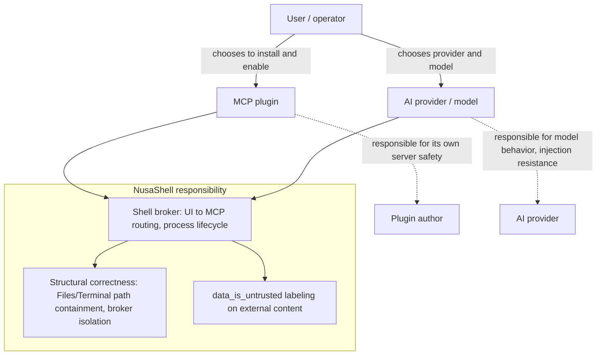

# Security & responsibility boundary

**Status:** Accepted
**Date:** 2026-08-02

NusaShell is an MCP-first **shell platform** for AI tools: it brokers
lifecycle and tool calls between plugin UIs, MCP servers, and AI providers.
It is **not** a security product that vets, sandboxes, or certifies what those
MCP servers or models do once the user has chosen to enable them.

This document is the authoritative product stance. It replaces any older
implication that a future NusaShell phase would police MCP server behavior,
AI model decisions, or prompt-injection resistance beyond the structural
guards listed below.

## Responsibility split

| Party | Owns |
| --- | --- |
| **User / operator** | Which plugins to install and enable; which AI providers and models to use; accepting that enabled tools and models can take destructive or unexpected actions. |
| **MCP plugin author** | Safety and correctness of their MCP server implementation (what tools do on the host, credential handling, path containment for that server). |
| **AI provider / model** | Model behavior, tool-call decisions, and resistance to prompt/tool injection in content the model receives. |
| **NusaShell** | Broker isolation, process lifecycle correctness, and the structural guards listed under "In scope" below. |

## In scope for NusaShell (keep)

These are platform correctness and isolation properties — not a claim that
installed plugins or models are "safe":

- **Broker isolation:** plugin UI and MCP never peer-connect; all traffic goes
  through the shell (`docs/blueprint.md`, architecture locks).
- **Process lifecycle:** spawn, stop, crash detection via
  `PluginRuntimeManager`.
- **Bundled Terminal path containment:** `resolvePath` (and related guards)
  reject relative-path root escapes (`../` traversal) for the bundled Terminal
  plugin. Absolute paths are accepted as-is — the agent is a trusted actor
  operating on behalf of the user and may access any path the user can. The
  root is a convenience for relative path resolution, not a jail. This is a
  correctness guard for that plugin, not a security certification of
  third-party MCP servers. (The bundled Files plugin's containment was
  reversed on 2026-08-04 — see
  [`docs/architecture/plugin-sandbox-readiness.md`](./plugin-sandbox-readiness.md)
  Finding 1.)
- **`data_is_untrusted` labeling:** external tool/resource/docs content is
  marked so the model is instructed to treat it as data, not instructions.
  Labeling is not a filter or injection detector.
- **Future host-isolation phase** (still deferred, still planned): iframe
  sandbox attributes, install-time permission prompts, and process isolation
  that protect the **host process** from a plugin process. That phase does
  **not** include vetting plugin **behavior**, moderating model output, or
  building prompt-injection defenses.

## Permanently out of scope

NusaShell will **not** treat the following as product work:

- Vetting, auditing, or certifying any installed MCP server's implementation
  or behavior.
- Sandboxing or restricting what a running MCP tool call may do on the host
  beyond the bundled Files/Terminal containment above.
- Moderating, filtering, or blocking AI model output or tool-call decisions.
- Detecting or defending against prompt injection in tool/resource content
  beyond the existing `data_is_untrusted` label.
- Approval gates, allowlists of launch `args`/`env`, or signed-manifest
  verification before an agent-driven MCP launch override takes effect.
- Liability for destructive or unexpected actions taken by an MCP tool or AI
  model the user chose to enable.

AI models and MCP servers have unpredictable behavior by nature. NusaShell
provides a place for them to run and a broker between them; the user who
enables a plugin or model, and the authors/providers of those components,
remain responsible for outcomes outside the structural platform guarantees
above.

## Relationship to other docs

| Doc | Role relative to this boundary |
| --- | --- |
| [`docs/RISK.md`](../RISK.md) | Residual risks that remain *because* behavioral security is out of scope |
| [`docs/blueprint.md`](../blueprint.md) | Host-isolation phase still deferred; MCP/AI behavioral hardening is not that phase |
| [`docs/architecture/mcp-capability-policy.md`](./mcp-capability-policy.md) | Capability adoption gates (e.g. sampling consent UX) are about NusaShell-executed protocol features, not third-party MCP vetting |
| [`docs/architecture/plugin-sandbox-readiness.md`](./plugin-sandbox-readiness.md) | Structural mitigations (Files containment, process-death SoT) — keep; do not expand into behavioral sandboxing |

## Contributor rule

Do not open PRs or roadmap items that add MCP/AI behavioral hardening
(approval gates for every tool call, injection filters, plugin allowlists,
"safe mode" model wrappers) under the assumption that security was merely
deferred. Host-isolation work remains valid; behavioral policing of MCP and
AI does not.
