# NusaShell Backend Structure

This document defines the **target** NusaShell backend folder structure using
**Clean Architecture** with **Electron IPC as the primary desktop client
transport** (WebSocket is a legacy/optional adapter for non-Electron hosts).

It is not a description of the tree on disk today. The repo is still
concept-stage: see [`../README.md`](../README.md). Product/plugin UX lives in
[`blueprint.md`](./blueprint.md). The runnable bridge demo is [`PoC/`](./PoC/).

## Document roles

| Doc | Normative for |
| --- | --- |
| [`blueprint.md`](./blueprint.md) | Plugin package shape, launcher UX, MCP transport choices, high-level host architecture |
| **This file** | Monorepo layout, dependency rule, runtime ownership, WebSocket protocol, MVP package scope |
| [`PoC/`](./PoC/) | Behavioral reference only (collapsed host+backend in one Node process) |

### How this relates to the plugin UI bridge

[`blueprint.md`](./blueprint.md) describes `window.shell.callTool` / `postMessage`
between the **plugin iframe** and the **host renderer**.

This document describes **WebSocket** between the **host** (or any client) and
the **backend**. The renderer should use `packages/plugin-sdk` (`NusaClient`)
over that WebSocket. The iframe bridge is a thin host-side adapter that turns
`callTool` into SDK/backend commands - it must not open a second path straight
to MCP processes.

WebSocket remains only a transport adapter. It must not become the internal
event bus.

The main goals are:

- WebSocket remains only a transport adapter.
- Clients never communicate directly with workers, processes, schedulers, or MCP servers.
- Every command enters through the application layer.
- Runtime state is owned by a clearly defined domain component.
- Every client-facing event exits through a single event gateway.
- The backend core can be tested without Electron or WebSocket.

---

## 1. Architecture Principles

Command flow:

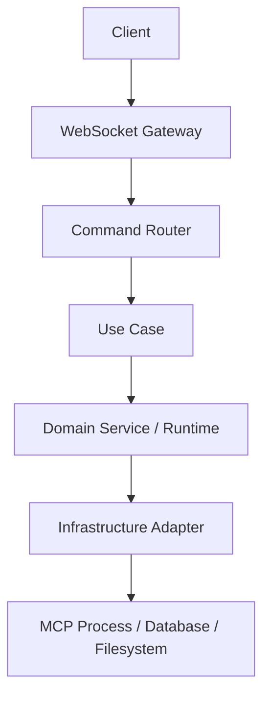

Event flow:

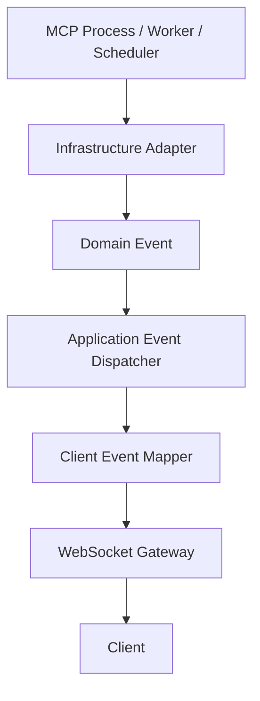

Core rules:

```text
Commands enter through one gateway.
State changes happen under one owner.
Events leave through one gateway.
```

WebSocket must not be used as the internal event bus. It only connects clients to the application layer.

---

## 2. Repository Structure

Target layout after scaffolding (not present in the repo yet):

```text
nusashell/
├── apps/
│   ├── desktop/
│   │   ├── src/
│   │   │   ├── main/
│   │   │   │   ├── bootstrap.ts
│   │   │   │   ├── window-manager.ts
│   │   │   │   ├── app-lifecycle.ts
│   │   │   │   └── native-capabilities.ts
│   │   │   ├── preload/
│   │   │   │   └── index.ts
│   │   │   └── renderer/
│   │   └── package.json
│   │
│   └── backend/
│       ├── src/
│       │   ├── bootstrap.ts
│       │   ├── container.ts
│       │   └── shutdown.ts
│       └── package.json
│
├── packages/
│   ├── domain/
│   ├── application/
│   ├── infrastructure/
│   ├── transport-ws/
│   ├── contracts/
│   ├── plugin-sdk/
│   ├── shared/
│   └── testing/
│
├── plugins/
│   └── examples/
│       └── notes/
│
├── docs/
│   ├── blueprint.md              # product / plugin architecture (exists)
│   ├── backend-structure.md      # this file (exists)
│   ├── PoC/                      # runnable bridge demo (exists)
│   ├── ui-design/          # launcher sketch (exists)
│   └── architecture/             # planned splits (optional later)
│       ├── websocket-protocol.md
│       ├── plugin-lifecycle.md
│       ├── manifest-spec.md
│       ├── job-automation.md      # scheduled jobs (Phase F)
│       ├── acp-threads.md         # ACP external-agent conversations
│       ├── plugin-sandbox-readiness.md  # Files containment, crash SoT, Tools=0 honesty
│       └── workspace-mcp-binding.md     # conversation.workspace → MCP (wrap → Roots → respawn)
│
├── scripts/
│   ├── build.ts
│   ├── package-plugin.ts
│   └── validate-manifest.ts
│
├── package.json
├── pnpm-workspace.yaml
├── tsconfig.base.json
└── vitest.workspace.ts
```

Until that tree exists, treat [`PoC/`](./PoC/) as the only runnable backend/UI
and keep inventing paths aligned with this section - not with a root-level
`server.js`.

---

## 3. Dependency Rule

Dependencies may only point inward:

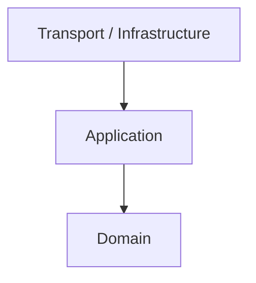

Import rules:

```text
domain          → must not import application/infrastructure/transport
application     → may import domain
infrastructure  → may import application + domain
transport-ws    → may import application + contracts
desktop         → may import application bootstrap / backend client
```

The domain layer must not know about:

- Electron
- WebSocket
- SQLite
- Node.js child processes
- the filesystem
- the MCP SDK
- HTTP
- SSE

---

## 4. `domain` Package

```text
packages/domain/
├── src/
│   ├── plugin/
│   │   ├── entities/
│   │   │   ├── plugin.ts
│   │   │   ├── plugin-manifest.ts
│   │   │   └── plugin-runtime.ts
│   │   │
│   │   ├── value-objects/
│   │   │   ├── plugin-id.ts
│   │   │   ├── plugin-version.ts
│   │   │   ├── runtime-state.ts
│   │   │   └── transport-type.ts
│   │   │
│   │   ├── events/
│   │   │   ├── plugin-installed.event.ts
│   │   │   ├── plugin-started.event.ts
│   │   │   ├── plugin-stopped.event.ts
│   │   │   ├── plugin-crashed.event.ts
│   │   │   ├── plugin-state-changed.event.ts
│   │   │   └── tool-call-completed.event.ts
│   │   │
│   │   ├── services/
│   │   │   ├── plugin-lifecycle-policy.ts
│   │   │   └── runtime-transition-policy.ts
│   │   │
│   │   └── errors/
│   │       ├── invalid-runtime-transition.error.ts
│   │       ├── plugin-disabled.error.ts
│   │       └── plugin-not-found.error.ts
│   │
│   ├── tool/
│   │   ├── entities/
│   │   │   └── tool-call.ts
│   │   ├── value-objects/
│   │   │   ├── tool-name.ts
│   │   │   └── request-id.ts
│   │   └── errors/
│   │       ├── tool-call-timeout.error.ts
│   │       └── tool-not-found.error.ts
│   │
│   ├── shared/
│   │   ├── domain-event.ts
│   │   ├── entity.ts
│   │   └── result.ts
│   │
│   └── index.ts
└── package.json
```

### Domain responsibilities

The domain layer owns:

- plugin identity;
- validated plugin manifests;
- lifecycle state;
- state transition rules;
- domain errors;
- domain events;
- `idle → starting → running → stopping` rules;
- `crashed → starting` rules;
- disabled plugin rules;
- runtime invariants.

The domain layer does not spawn processes directly.

Example runtime state:

```ts
export type PluginRuntimeState =
  | "idle"
  | "starting"
  | "running"
  | "background"
  | "stopping"
  | "crashed"
  | "disabled";
```

---

## 5. `application` Package

```text
packages/application/
├── src/
│   ├── plugin/
│   │   ├── commands/
│   │   │   ├── install-plugin/
│   │   │   │   ├── install-plugin.command.ts
│   │   │   │   ├── install-plugin.handler.ts
│   │   │   │   └── install-plugin.result.ts
│   │   │   │
│   │   │   ├── uninstall-plugin/
│   │   │   ├── start-plugin/
│   │   │   ├── stop-plugin/
│   │   │   ├── restart-plugin/
│   │   │   ├── open-plugin/
│   │   │   └── update-plugin-settings/
│   │   │
│   │   ├── queries/
│   │   │   ├── get-plugin/
│   │   │   ├── list-plugins/
│   │   │   ├── get-plugin-state/
│   │   │   └── list-running-plugins/
│   │   │
│   │   ├── services/
│   │   │   ├── plugin-runtime-manager.ts
│   │   │   ├── plugin-operation-queue.ts
│   │   │   └── plugin-recovery-service.ts
│   │   │
│   │   └── ports/
│   │       ├── plugin-repository.port.ts
│   │       ├── plugin-process.port.ts
│   │       ├── plugin-package.port.ts
│   │       ├── manifest-validator.port.ts
│   │       └── clock.port.ts
│   │
│   ├── tool/
│   │   ├── commands/
│   │   │   ├── call-tool/
│   │   │   │   ├── call-tool.command.ts
│   │   │   │   ├── call-tool.handler.ts
│   │   │   │   └── call-tool.result.ts
│   │   │   └── cancel-tool-call/
│   │   │
│   │   ├── queries/
│   │   │   └── list-tools/
│   │   │
│   │   └── ports/
│   │       ├── mcp-client.port.ts
│   │       └── tool-call-registry.port.ts
│   │
│   ├── events/
│   │   ├── application-event.ts
│   │   ├── event-dispatcher.ts
│   │   ├── event-handler.ts
│   │   └── handlers/
│   │       ├── persist-plugin-state.handler.ts
│   │       ├── publish-client-event.handler.ts
│   │       └── cleanup-crashed-runtime.handler.ts
│   │
│   ├── messaging/
│   │   ├── command.ts
│   │   ├── command-bus.ts
│   │   ├── command-handler.ts
│   │   ├── query.ts
│   │   ├── query-bus.ts
│   │   └── query-handler.ts
│   │
│   ├── errors/
│   │   ├── application.error.ts
│   │   ├── conflict.error.ts
│   │   └── operation-timeout.error.ts
│   │
│   └── index.ts
└── package.json
```

### Application layer responsibilities

The application layer owns:

- use cases;
- orchestration;
- transaction boundaries;
- operation queues;
- single-flight startup;
- timeout and cancellation;
- repository calls;
- process adapter calls;
- domain event dispatch;
- mapping domain errors to application errors.

The application layer must not know the WebSocket frame format.

---

## 6. Runtime Manager

`PluginRuntimeManager` is the central owner of plugin lifecycle behavior.

```text
PluginRuntimeManager
├── ensures one runtime per plugin
├── ensures single-flight startup
├── serializes operations per plugin
├── stores active runtimes in memory
├── rejects invalid transitions
├── cleans up pending requests after crashes
└── publishes domain events
```

Internal structure:

```ts
interface RuntimeEntry {
  pluginId: string;
  state: PluginRuntimeState;
  startPromise: Promise<void> | null;
  operationQueue: PluginOperationQueue;
  process: PluginProcessPort | null;
  mcpClient: McpClientPort | null;
  pendingCalls: Map<string, PendingToolCall>;
  restartCount: number;
}
```

Each plugin has its own queue:

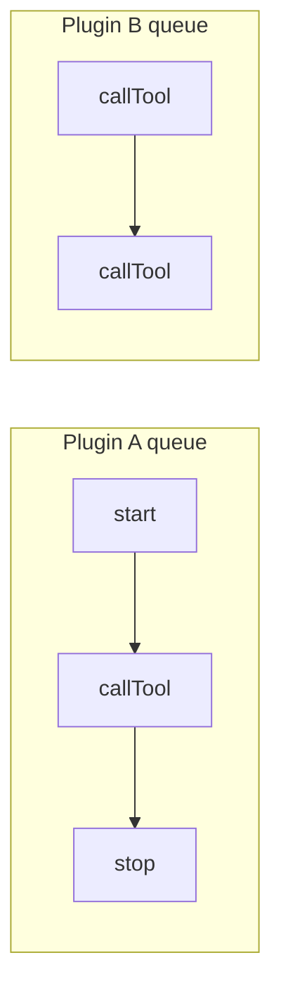

Operations across different plugins may run concurrently. Operations within the same plugin are serialized when they affect lifecycle state.

---

## 7. `infrastructure` Package

```text
packages/infrastructure/
├── src/
│   ├── persistence/
│   │   ├── sqlite/
│   │   │   ├── database.ts
│   │   │   ├── migrations/
│   │   │   ├── repositories/
│   │   │   │   ├── sqlite-plugin.repository.ts
│   │   │   │   ├── sqlite-plugin-settings.repository.ts
│   │   │   │   └── sqlite-install-history.repository.ts
│   │   │   └── transaction-manager.ts
│   │   └── in-memory/
│   │       └── in-memory-plugin.repository.ts
│   │
│   ├── process/
│   │   ├── node-child-process.adapter.ts
│   │   ├── process-handle.ts
│   │   ├── process-output-reader.ts
│   │   ├── process-shutdown.ts
│   │   └── executable-resolver.ts
│   │
│   ├── mcp/
│   │   ├── mcp-client.factory.ts
│   │   ├── stdio-mcp-client.adapter.ts
│   │   ├── streamable-http-mcp-client.adapter.ts
│   │   ├── legacy-sse-mcp-client.adapter.ts
│   │   └── mcp-error.mapper.ts
│   │
│   ├── plugins/
│   │   ├── filesystem-plugin-package.adapter.ts
│   │   ├── zip-plugin-package.adapter.ts
│   │   ├── plugin-directory-layout.ts
│   │   ├── atomic-plugin-installer.ts
│   │   └── plugin-uninstaller.ts
│   │
│   ├── manifest/
│   │   ├── zod-manifest-validator.adapter.ts
│   │   └── manifest-schema.ts
│   │
│   ├── logging/
│   │   ├── pino-logger.adapter.ts
│   │   └── plugin-log-writer.ts
│   │
│   ├── scheduling/
│   │   ├── idle-timeout.scheduler.ts
│   │   └── runtime-health-check.scheduler.ts
│   │
│   ├── system/
│   │   ├── system-clock.adapter.ts
│   │   ├── app-paths.ts
│   │   └── platform-info.ts
│   │
│   └── index.ts
└── package.json
```

### Infrastructure rules

Infrastructure may generate events from:

- child process exits;
- MCP connection closures;
- filesystem watchers;
- schedulers;
- idle timeouts;
- health checks.

Infrastructure must not send WebSocket messages directly.

Incorrect:

```ts
socket.send({
  type: "plugin.crashed",
  pluginId,
});
```

Correct:

```ts
eventDispatcher.publish(
  new PluginCrashedEvent(pluginId, reason),
);
```

---

## 8. `transport-ws` Package

```text
packages/transport-ws/
├── src/
│   ├── server/
│   │   ├── websocket-server.ts
│   │   ├── websocket-session.ts
│   │   ├── session-registry.ts
│   │   └── connection-lifecycle.ts
│   │
│   ├── protocol/
│   │   ├── incoming-message.ts
│   │   ├── outgoing-message.ts
│   │   ├── protocol-version.ts
│   │   ├── message-types.ts
│   │   └── websocket-error.ts
│   │
│   ├── routing/
│   │   ├── message-router.ts
│   │   ├── command-route.ts
│   │   ├── query-route.ts
│   │   └── routes/
│   │       ├── plugin-start.route.ts
│   │       ├── plugin-stop.route.ts
│   │       ├── plugin-list.route.ts
│   │       ├── plugin-install.route.ts
│   │       ├── tool-call.route.ts
│   │       └── tool-cancel.route.ts
│   │
│   ├── validation/
│   │   ├── incoming-message.validator.ts
│   │   └── payload-schemas/
│   │
│   ├── mapping/
│   │   ├── command.mapper.ts
│   │   ├── query.mapper.ts
│   │   ├── response.mapper.ts
│   │   ├── error.mapper.ts
│   │   └── client-event.mapper.ts
│   │
│   ├── events/
│   │   ├── websocket-event-publisher.ts
│   │   └── client-subscription-registry.ts
│   │
│   ├── auth/
│   │   ├── session-token.ts
│   │   └── websocket-authenticator.ts
│   │
│   └── index.ts
└── package.json
```

### WebSocket transport responsibilities

The transport layer only handles:

- connections;
- sessions;
- authentication;
- protocol versions;
- message parsing;
- validation;
- routing;
- response correlation;
- error mapping;
- publishing events to clients.

The transport layer must not own plugin runtime state.

### In-process Electron IPC vs WebSocket

The Electron desktop app uses **IPC as the primary client transport**. The
renderer talks to main via `window.shell.backend.request(method, payload)` →
`ipcMain.handle("shell:request")` → `MessageRouter` → `commandBus` / `queryBus`.
Events flow back via `eventDispatcher.onAny` → `webContents.send("shell:event")`.

| Path | Used by | Mechanism | Status |
| --- | --- | --- | --- |
| **Electron IPC** | Renderer (launcher, plugin windows) | `ipcMain.handle` → `MessageRouter` → `commandBus` / `queryBus` | **Primary** — zero-latency, no TCP socket, no port allocation |
| **WebSocket** | Historical / optional non-Electron clients | `ws` → `MessageRouter` → `commandBus` / `queryBus` | **Legacy** — server not started in desktop product path (`startWsServer: false`) |

Both paths converge on the **same `MessageRouter`** — they are transport
alternatives, not separate APIs. The `IpcRequestBridge` in
`apps/desktop/src/main/ipc-bridge.ts` reuses the same `MessageRouter` that the
WS transport uses, so method → bus mapping is identical. The
`IpcEventBridge` reuses `mapDomainEvent` so event payloads match the former WS
envelopes exactly.

The desktop renderer no longer imports `@nusashell/plugin-sdk` or
`NusaClient`. The `ws-client.js` shim in the renderer now delegates to
`window.shell.backend.*` (IPC) while preserving the former `sendRequest` /
`onEvent` / `subscribe` exports so call sites did not need to change.

The `NusaClient` SDK (in `@nusashell/plugin-sdk`) remains the canonical client
for non-Electron hosts (TUI, external integrations) if WebSocket is revived.
The `@nusashell/transport-ws` package is kept for tests and legacy consumers.

---

## 9. WebSocket Protocol

### Request

```json
{
  "kind": "request",
  "id": "req_01J...",
  "method": "plugin.start",
  "payload": {
    "pluginId": "nusashell.notes"
  }
}
```

### Successful response

```json
{
  "kind": "response",
  "id": "req_01J...",
  "ok": true,
  "result": {
    "pluginId": "nusashell.notes",
    "state": "running"
  }
}
```

### Error response

```json
{
  "kind": "response",
  "id": "req_01J...",
  "ok": false,
  "error": {
    "code": "PLUGIN_START_FAILED",
    "message": "Plugin process failed to start",
    "details": null
  }
}
```

### Event

```json
{
  "kind": "event",
  "event": "plugin.state_changed",
  "sequence": 182,
  "payload": {
    "pluginId": "nusashell.notes",
    "previousState": "starting",
    "state": "running"
  }
}
```

### Protocol rules

- Every request must have an `id`.
- Every response must include the same `id`.
- Events do not use request IDs.
- Events include a `sequence`.
- Request-response messages and events must remain separate.
- A client must not assume a command succeeded based only on an event.
- Command results come from responses.
- Events only describe state changes or background activity.

---

## 10. Message Router

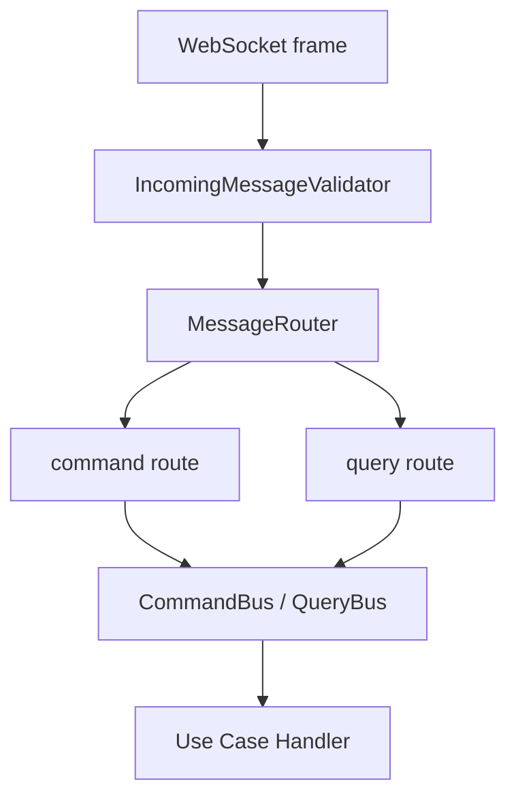

Example mapping:

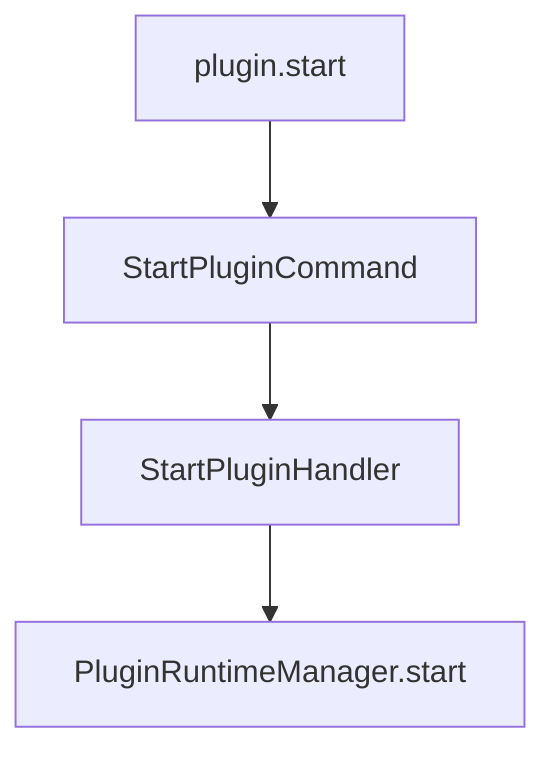

Disallowed:

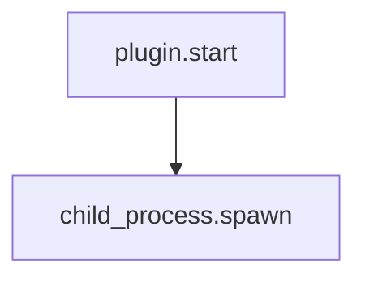

The transport layer must not access infrastructure directly.

---

## 11. `contracts` Package

```text
packages/contracts/
├── src/
│   ├── websocket/
│   │   ├── requests/
│   │   ├── responses/
│   │   ├── events/
│   │   ├── errors/
│   │   └── schemas/
│   │
│   ├── plugin/
│   │   ├── plugin.dto.ts
│   │   ├── plugin-runtime.dto.ts
│   │   └── plugin-manifest.dto.ts
│   │
│   ├── tool/
│   │   ├── tool-call.dto.ts
│   │   └── tool-result.dto.ts
│   │
│   └── index.ts
└── package.json
```

This package may be used by:

- the backend;
- the renderer;
- the plugin SDK;
- integration tests.

Do not expose domain entities directly to clients.

---

## 12. `plugin-sdk` Package

```text
packages/plugin-sdk/
├── src/
│   ├── client/
│   │   ├── nusa-client.ts
│   │   ├── websocket-connection.ts
│   │   ├── request-manager.ts
│   │   ├── event-subscriber.ts
│   │   └── reconnect-policy.ts
│   │
│   ├── api/
│   │   ├── plugins-api.ts
│   │   ├── tools-api.ts
│   │   └── system-api.ts
│   │
│   ├── errors/
│   │   ├── nusa-client.error.ts
│   │   ├── request-timeout.error.ts
│   │   └── connection-closed.error.ts
│   │
│   └── index.ts
└── package.json
```

The renderer should use the SDK:

```ts
const client = new NusaClient({
  url,
  token,
});

await client.connect();

const result = await client.plugins.start(
  "nusashell.notes",
);
```

The renderer should not manage request maps manually.

Plugin iframes keep the simpler author API from [`blueprint.md`](./blueprint.md)
(`window.shell.callTool(...)`). The host implements that helper by forwarding
to `NusaClient` / backend commands - never by talking to the MCP child process
from the iframe.

---

## 13. Bootstrap

```text
apps/backend/src/bootstrap.ts
```

Bootstrap order:

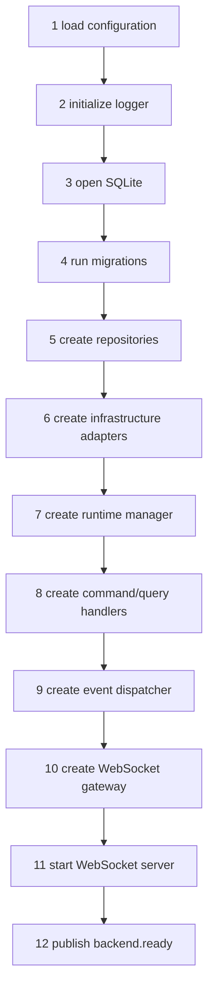

Example composition root:

```ts
const pluginRepository =
  new SqlitePluginRepository(database);

const processAdapter =
  new NodeChildProcessAdapter(logger);

const mcpClientFactory =
  new McpClientFactory(logger);

const runtimeManager =
  new PluginRuntimeManager({
    pluginRepository,
    processAdapter,
    mcpClientFactory,
    eventDispatcher,
  });

const commandBus = createCommandBus({
  startPlugin: new StartPluginHandler(runtimeManager),
  stopPlugin: new StopPluginHandler(runtimeManager),
  callTool: new CallToolHandler(runtimeManager),
});

const wsServer = new WebSocketServer({
  commandBus,
  queryBus,
  eventDispatcher,
  validator,
});
```

---

## 14. Shutdown

Shutdown must be centralized:

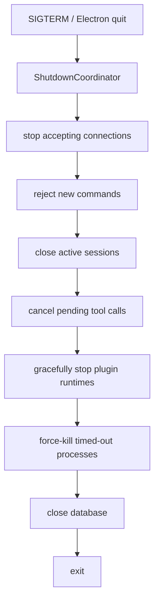

Structure:

```text
apps/backend/src/shutdown.ts
packages/application/src/lifecycle/shutdown-coordinator.ts
```

Do not spread cleanup logic across unrelated listeners.

---

## 15. Testing

```text
packages/testing/
├── src/
│   ├── fakes/
│   │   ├── fake-plugin-process.ts
│   │   ├── fake-mcp-client.ts
│   │   ├── fake-plugin-repository.ts
│   │   └── fake-clock.ts
│   │
│   ├── fixtures/
│   │   ├── plugin-manifest.fixture.ts
│   │   └── plugin-runtime.fixture.ts
│   │
│   ├── helpers/
│   │   ├── websocket-test-client.ts
│   │   └── eventually.ts
│   │
│   └── index.ts
└── package.json
```

Test categories:

```text
Unit tests
├── domain transitions
├── use cases
├── runtime queue
├── single-flight startup
└── error mapping

Integration tests
├── WebSocket request-response
├── SQLite repository
├── process spawning
├── MCP stdio
└── shutdown

End-to-end tests
├── connect client
├── list plugins
├── start plugin
├── call tool
├── receive event
└── stop plugin
```

Required race-condition tests:

```text
two concurrent start requests
concurrent start and stop
callTool while starting
process crash during callTool
timeout followed by a late response
client disconnect during an active request
backend shutdown while plugins are active
duplicate request ID
reconnect and resubscribe
```

---

## 16. Error Boundary

Error flow:

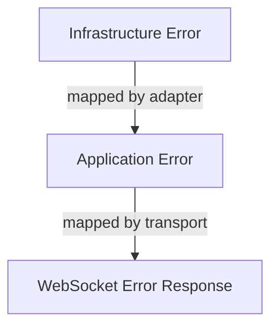

Example error codes:

```ts
export type ErrorCode =
  | "INVALID_REQUEST"
  | "UNAUTHORIZED"
  | "PLUGIN_NOT_FOUND"
  | "PLUGIN_DISABLED"
  | "INVALID_RUNTIME_TRANSITION"
  | "PLUGIN_START_FAILED"
  | "PLUGIN_STOP_FAILED"
  | "PLUGIN_CRASHED"
  | "TOOL_NOT_FOUND"
  | "TOOL_CALL_TIMEOUT"
  | "TOOL_CALL_CANCELLED"
  | "MCP_CONNECTION_FAILED"
  | "INTERNAL_ERROR";
```

Clients must not receive stack traces or raw child-process errors.

---

## 17. Source of Truth

The source of truth must be explicit:

```text
Installed plugin metadata → SQLite
  (filesystem / JSON registry is acceptable only as an early spike before SQLite)
Current runtime state     → PluginRuntimeManager memory
Process state             → Process adapter
Client session state      → WebSocket Session Registry
Pending request state     → WebSocket Request Manager
Pending tool calls        → PluginRuntimeManager
```

Do not duplicate sources of truth.

Avoid this:

```text
renderer stores running state
WebSocket gateway stores running state
database stores running state
runtime manager stores running state
```

The frontend may keep a cached projection, but the backend runtime remains authoritative.

This matches the lifecycle discussion in [`blueprint.md`](./blueprint.md) §3.5:
launcher badges are projections; `PluginRuntimeManager` owns live state.

---

## 18. Minimum MVP

For the first MVP, implement only:

```text
packages/
├── domain/
│   └── plugin runtime state
├── application/
│   ├── list plugins
│   ├── start plugin
│   ├── stop plugin
│   └── call tool
├── infrastructure/
│   ├── filesystem plugin registry
│   ├── child process
│   └── MCP stdio
├── transport-ws/
│   ├── request-response
│   └── plugin state events
├── contracts/
└── plugin-sdk/
```

Not required in the first phase:

- an external CQRS framework;
- event sourcing;
- a distributed message broker;
- Redis;
- microservices;
- a large dependency injection framework;
- a generic workflow engine;
- a persistent event log;
- clustered workers.

The Command Bus and Event Dispatcher should remain simple internal classes.

---

## 19. Recommended Stack

```text
Runtime              Node.js + TypeScript
Desktop Host         Electron
WebSocket Server     ws
Validation           Zod
MCP Client           Official MCP TypeScript SDK
Database             SQLite
SQLite Driver        better-sqlite3
Logging              Pino
Testing              Vitest
Package Manager      pnpm workspace
Build                tsup / tsdown
Desktop Packaging    Electron Forge
```

The `ws` library is recommended because it is thin and predictable. Avoid Socket.IO in the core unless fallback transports, complex rooms, or Socket.IO-specific protocol features are genuinely required.

---

## 20. Architecture Summary

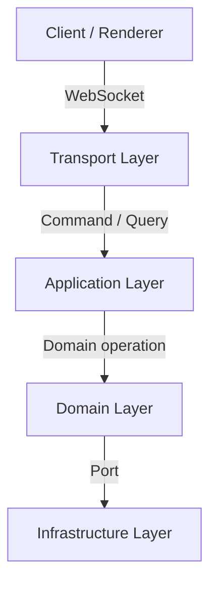

Transport owns session, auth, validation, routing, and response mapping.
Application owns use cases, queues, single-flight, and the event dispatcher.
Domain owns plugin identity, runtime state, lifecycle policy, and events.
Infrastructure owns SQLite, process, MCP, filesystem, and scheduler adapters.
WebSocket remains full-duplex, but that full-duplex behavior is contained at the transport boundary. Workers, schedulers, MCP processes, and services must never communicate directly with the socket.

With this structure, WebSocket can later be replaced or supplemented by HTTP, SSE, CLI, or Electron IPC without changing the core domain and use cases.
