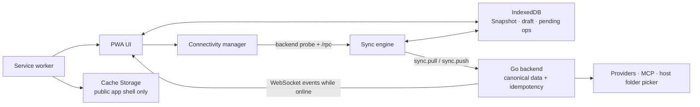

# ADR-001: PWA dan mode offline-first untuk NusaShell

## Status

Proposed

## Date

2026-08-13

## Context

NusaShell sudah memiliki frontend native ES module yang disajikan dari
satu origin oleh binary Go. Ini modal yang baik untuk PWA: tidak ada bundler
produksi, aset mudah diaudit, dan semua tampilan berbicara ke satu kontrak
`/rpc`. Namun saat ini browser tetap bergantung penuh pada proses Go:

- tidak ada web manifest, service worker, atau cache aplikasi;
- semua data percakapan, konfigurasi, dan log hanya berada di backend;
- WebSocket hanya memberi event proses hidup; ia tidak memiliki cursor,
  replay, atau revision untuk sinkronisasi;
- semua aksi frontend gagal ketika `POST /rpc` tidak dapat dijangkau.

Penting untuk membedakan dua keadaan yang sering sama-sama disebut
“offline”. Perangkat bisa tidak memiliki internet, sementara backend Go lokal
tetap hidup dan provider lokal masih dapat dipakai. Sebaliknya, PWA dapat
dibuka dari cache saat binary Go mati, walaupun perangkat tetap tersambung ke
Wi-Fi. Dokumen ini menyebut keadaan kedua sebagai **backend unavailable**.

Tujuannya bukan memindahkan agent ke browser. Tujuannya adalah membuat aplikasi
tetap tenang dan tidak kehilangan pekerjaan pengguna ketika backend sementara
tidak ada: UI bisa dibuka, salinan percakapan yang dipilih masih terbaca, draft
aman, dan pesan dapat diantrikan untuk dijalankan ketika backend kembali.

## Assessment

### Yang sudah siap

- `frontend/` sudah berupa HTML, CSS, dan ES modules native dalam satu origin.
  Hal ini cocok untuk precache tanpa menambah build tool produksi.
- `frontend/embed.go` membuat aset dapat terus disajikan oleh binary yang sama;
  mode pengembangan juga tetap memakai pohon aset yang identik.
- `frontend/js/rpc.js` sudah memiliki satu pintu untuk HTTP RPC dan status
  WebSocket. Ia adalah titik tepat untuk menambah status backend dan sync.
- Kontrak domain dan transport sudah dipisahkan dengan baik, sehingga method
  sync dapat ditambahkan secara additive ke `contracts/`, bukan berupa format
  browser khusus yang bocor ke domain.
- Ikon saat ini berukuran 512×512, sehingga dapat menjadi sumber ikon manifest
  512px dan turunan 192px.

### Kesenjangan yang harus diselesaikan

- Belum ada manifest atau service worker, sehingga aplikasi belum installable
  dan browser tidak memiliki app shell untuk dijalankan tanpa server.
- `http.FileServer` belum menetapkan kebijakan cache PWA atau MIME manifest
  secara eksplisit. Perilaku MIME JavaScript sudah terbukti berbeda antar-OS.
- `ConversationDTO` tidak memiliki `revision`; backend tidak dapat mendeteksi
  perubahan bersaing dari dua tab/perangkat atau memberi cursor perubahan.
- Tidak ada idempotency key pada mutasi. Retry pesan setelah koneksi putus dapat
  menjalankan satu agent turn dua kali.
- Penyimpanan conversation saat ini berupa satu file JSON per entity. Atomic
  rename melindungi satu file, tetapi tidak menyediakan transaksi yang sama
  untuk conversation, cursor perubahan, dan receipt idempotency.
- Batas `POST /rpc` adalah 1 MiB, sedangkan kontrak attachment menerima hingga
  empat file 4 MiB. Data URL untuk satu file sekitar 4 MiB sudah melampaui
  batas tersebut. Ini adalah ketidakcocokan kontrak yang perlu diselesaikan
  sebelum attachment dapat masuk ke antrean offline.
- Workspace saat ini adalah path absolut yang dipilih oleh dialog host Go.
  Browser tidak dapat menggantikan kemampuan ini secara portabel.

Kesimpulannya: **PWA shell layak dikerjakan sekarang, tetapi backend-offline
mode belum boleh diperlakukan sebagai agent mode.**

## Decision

NusaShell akan memakai desain **offline-first client cache, server-authoritative
agent**.

1. Service worker hanya menyimpan app shell publik: HTML, CSS, JavaScript,
   font, manifest, dan ikon. Ia tidak pernah menyimpan respons `/rpc`, `/ws`,
   atau `/events`.
2. IndexedDB menyimpan snapshot percakapan yang pengguna izinkan untuk tersedia
   offline, draft, metadata sinkronisasi, dan operasi yang belum terkirim.
   `localStorage` tetap hanya untuk preferensi kecil seperti sidebar mode.
3. Saat backend tidak tersedia, UI masuk ke mode **Offline ready**. Pengguna
   dapat membaca snapshot, menulis draft, dan memilih **Queue message**.
   Pesan tidak diberi kesan seolah-olah sudah diproses model.
4. Saat backend kembali, sync engine menarik perubahan server, mengirim operasi
   yang masih pending secara idempotent, lalu merefresh data dari backend.
   WebSocket kembali dipakai hanya untuk streaming proses yang baru berjalan.
5. Agent provider calls, API keys, MCP stdio, document tools, compaction, dan
   native workspace picker tetap berjalan di Go. PWA tidak mengakses provider
   langsung dan tidak menyimpan API key di browser.

Model ini menjaga batas arsitektur yang sekarang: browser mengelola pengalaman
dan cache lokal; backend tetap menjadi pemilik data kanonis serta satu-satunya
pelaksana operasi host dan agent.



## PWA delivery design

### Installable shell

Add the following embedded assets:

```text
frontend/app.webmanifest
frontend/sw.js
frontend/icons/nusashell-192.png
frontend/icons/nusashell-512.png
frontend/js/pwa/register.js
```

`index.html` links the manifest and registers the worker from `app.js` only
when `navigator.serviceWorker` exists. The manifest uses:

```json
{
  "id": "/",
  "name": "NusaShell",
  "short_name": "NusaShell",
  "start_url": "/#agent",
  "scope": "/",
  "display": "standalone",
  "theme_color": "#101512",
  "background_color": "#101512"
}
```

It must declare both 192px and 512px PNG icons. Chromium install prompts
require manifest metadata, including those icon sizes, and an installable PWA
must use HTTPS or loopback such as `localhost` / `127.0.0.1`. See MDN’s
[installability requirements](https://developer.mozilla.org/en-US/docs/Web/Progressive_web_apps/Guides/Making_PWAs_installable).

For NusaShell’s normal local use this means the PWA path is supported on
`http://127.0.0.1:<port>` and `http://localhost:<port>`. A LAN URL served via
plain HTTP is not an installable PWA; remote use needs TLS before it can claim
PWA support.

### Cache policy

The worker uses an explicit `PWA_CACHE_VERSION`. A release that changes the
shell increments this value. During `install`, it precaches the complete,
reviewed asset list. During `activate`, it deletes older NusaShell shell caches.

| Request class | Strategy | Rationale |
| --- | --- | --- |
| Navigation and `index.html` | Network first, cached shell fallback | Use a new shell when Go is alive; still open when it is not. |
| Known static assets | Cache first from the versioned shell cache | A cached installed app must boot without Go. |
| `/rpc`, `/ws`, `/events` | Network only | A cached RPC response could display stale state or falsely acknowledge a mutation. |
| Provider and third-party URLs | No worker caching | The frontend should not call these in the first place. |

Service workers intentionally sit between the app and network, can precache on
`install`, clean old caches on `activate`, and handle requests through `fetch`.
That is exactly the browser mechanism needed here. [MDN’s Service Worker
API guide](https://developer.mozilla.org/en-US/docs/Web/API/Service_Worker_API)
documents these lifecycle responsibilities.

`frontend/embed.go` must embed every new root asset and the `icons` directory.
`transport.StaticHandler` should set deterministic types for `.webmanifest`,
`.js`, and `.css`, and tests must fetch the manifest, service worker, and icons
from the embedded server. The manifest response must be
`application/manifest+json`.

## Offline data model

Use a small native IndexedDB wrapper in `frontend/js/offline/store.js`; do not
add a production Node dependency. The app has no frontend bundling step, and
the required IndexedDB queries are narrow enough that a tested local wrapper is
clearer than shipping a general-purpose browser database abstraction.

Database name: `nusashell-offline-v1`.

| Object store | Key | Contents | Retention |
| --- | --- | --- | --- |
| `meta` | string | stable `client_id`, sync cursor, schema metadata | until local data is cleared |
| `conversations` | conversation ID | offline-safe conversation projection and server revision | user-controlled offline copy |
| `messages` | message ID | text/reasoning/tool transcript for cached conversations | user-controlled offline copy |
| `drafts` | conversation ID | current unsent composer text | until sent or discarded |
| `pending_ops` | operation ID | ordered, idempotent mutations | until acknowledged or explicitly discarded |
| `pending_blobs` | operation ID + attachment ID | original queued attachment bytes as `Blob` | until server acknowledgement |

The offline conversation projection stores a workspace **label**, never the
absolute `workspace` path returned by Go. It stores attachment metadata after
acknowledgement, not a second permanent copy of the attachment data URL.
Queued attachments retain their Blob only long enough to submit successfully.

Saving full conversation text locally changes the user’s storage footprint.
The first time offline history is enabled, show a clear opt-in explaining that
the browser will retain a local copy. Unsent drafts always persist because
losing them on a backend restart is worse than retaining a small local value.
Provide “Clear offline copies” in Settings.

IndexedDB is appropriate for structured offline state and larger data; it is
asynchronous by design. Browser storage is best-effort by default, can be
evicted, and may fail with `QuotaExceededError`, so all writes need error
handling, a quota indication, and an optional `navigator.storage.persist()`
request after the user enables offline history. See [IndexedDB’s offline
storage rationale](https://developer.mozilla.org/en-US/docs/Web/API/IndexedDB_API/Using_IndexedDB)
and MDN’s [storage quota and eviction guidance](https://developer.mozilla.org/en-US/docs/Web/API/Storage_API/Storage_quotas_and_eviction_criteria).

## Connectivity and user experience

Replace the binary “Connected/Offline” presentation with explicit backend
states:

| State | Meaning | Composer behavior |
| --- | --- | --- |
| `online` | `/rpc` probe and WebSocket are healthy | Send normally. |
| `syncing` | Backend returned; local queue is reconciling | Show progress; preserve editable drafts. |
| `offline-ready` | Shell and IndexedDB are usable, Go is unavailable | Queue a message or save a draft. Do not show Send as successful. |
| `offline-empty` | No cached shell/data or browser storage failed | Explain that NusaShell must be opened once while backend is available. |
| `conflict` | A queued mutation cannot apply to the server revision | Keep both copies and ask the user to resolve. |

`navigator.onLine` and browser `online`/`offline` events are hints only.
They do not prove that the local Go server is reachable. The source of truth
is a bounded `app.info` request plus the WebSocket lifecycle, retried with
backoff. This follows MDN’s warning that `navigator.onLine` is inherently
unreliable for deciding feature availability. [MDN: Navigator.onLine](https://developer.mozilla.org/en-US/docs/Web/API/Navigator/onLine).

When the backend goes away during a streamed turn, show the persisted portion
as interrupted/unknown and refresh the conversation after reconnection. Do not
attempt to synthesize missing model deltas from the browser.

## Sync contract

The existing RPC roster remains compatible. Add a separate, additive sync
surface instead of changing the result shape of current methods:

```text
sync.bootstrap   -> current server cursor and initial offline-safe snapshot
sync.pull        -> ordered server changes after a cursor
sync.push        -> apply a bounded batch of client mutations idempotently
```

The conceptual wire types are:

```go
type SyncMutation struct {
    ID           string          `json:"id"`                    // client-generated UUID
    Kind         string          `json:"kind"`                  // conversation.create | conversation.rename | conversation.delete | turn.enqueue
    EntityID     string          `json:"entity_id"`
    BaseRevision *uint64         `json:"base_revision,omitempty"`
    Payload      json.RawMessage `json:"payload"`
    CreatedAt    string          `json:"created_at"`
}

type SyncPushRequest struct {
    ClientID  string         `json:"client_id"`
    Mutations []SyncMutation `json:"mutations"`
}

type SyncAck struct {
    MutationID string `json:"mutation_id"`
    EntityID   string `json:"entity_id"`
    Revision   uint64 `json:"revision"`
}

type SyncRejection struct {
    MutationID string `json:"mutation_id"`
    Code       string `json:"code"` // CONFLICT | VALIDATION_ERROR
    Message    string `json:"message"`
    Current    any    `json:"current,omitempty"`
}
```

The actual Go DTOs must be defined in `contracts/`, with golden fixtures and
transport-level tests. Existing methods remain unchanged. New fields such as
`revision` are additive and optional in existing DTOs until the UI consumes
them.

### Server responsibilities

The backend must add three durable pieces of state:

1. A monotonically increasing `revision` for every syncable conversation.
2. A durable change journal with cursor, entity kind, entity ID, revision, and
   operation type (`upsert` or `delete`). It lets `sync.pull` recover changes
   missed while WebSocket was disconnected.
3. A durable idempotency receipt keyed by mutation ID. A retry returns the
   original acknowledgement and never starts a second agent run.

`sync.push` validates the whole batch at the transport/application boundary,
then applies mutations in order. It must never report an acknowledgement until
both the entity change and idempotency receipt are durable. This requirement
means that the sync foundation migrates conversations to a dedicated SQLite
`state.db`: conversation revision, change journal, and idempotency receipt are
committed in one transaction. Existing JSON conversations are imported once at
startup before the new store takes ownership.

This is a deliberate boundary: the current `credentials.db` remains dedicated
to credentials. `state.db` owns syncable application state; provider keys never
move into it or into the browser. Continuing with separate JSON entity files
would make a correct retry protocol significantly more complex than the small,
well-scoped storage migration.

### Client algorithm

On startup, render IndexedDB immediately. In parallel, begin the backend probe.
When the probe succeeds:

1. call `sync.pull` from the stored cursor and apply returned changes in one
   IndexedDB transaction per batch;
2. submit pending operations in creation order per conversation, using the
   same mutation ID for every retry;
3. apply acknowledgements, remove acknowledged blobs/operations, and surface
   rejected operations as conflicts;
4. call `sync.pull` once more, then rely on normal WebSocket events while the
   connection remains open.

An offline `turn.enqueue` is only acknowledged after Go has durably accepted
it. The backend then starts the normal agent turn. If the browser disconnects
after acknowledgement, it rehydrates the resulting persisted message through
`sync.pull` or `agent.conversations.get`; it does not replay the turn.

Initial scope is one personal backend and one or more browser tabs for the
same user. Multiple independent devices are not silently merged. If a
mutation’s `base_revision` differs, the server rejects it with `CONFLICT`; the
client shows the current server copy and lets the user keep server data,
discard the local change, or explicitly retry a replacement. Immutable
`turn.enqueue` operations can merge only when their target conversation still
exists.

## Attachments and workspace boundaries

### Attachments

Do not place binary data in the normal sync batch. Store the original queued
files as Blobs in IndexedDB, then upload them after the backend returns using a
dedicated streamed upload route with a documented aggregate limit. The final
`turn.enqueue` mutation references server-issued upload IDs, not base64 data.

This fixes the existing 1 MiB `/rpc` versus 4×4 MiB attachment inconsistency
and keeps normal sync requests small, retryable, and inspectable. The upload
route needs its own request-size test, expiry policy for orphaned uploads, and
cleanup after the turn is accepted.

### Workspace

In `offline-ready`, show the last workspace label as context only and disable
the picker with the explanation “requires the NusaShell backend.” Do not use
`window.showDirectoryPicker()` as a replacement. It returns a browser
`FileSystemDirectoryHandle`, not the absolute path required by the Go tools;
it is secure-context-only, experimental, and not broadly available. [MDN’s
showDirectoryPicker reference](https://developer.mozilla.org/en-US/docs/Web/API/Window/showDirectoryPicker)
documents these limits.

The exact Electron-equivalent workspace behavior therefore remains a backend
capability. That is the correct trade-off for cross-browser PWA support.

## Explicit non-goals

- Run an LLM or provider adapter directly from the browser.
- Store API keys, MCP environment variables, or credential-store contents in
  Cache Storage, IndexedDB, or the web manifest.
- Run MCP stdio tools, inspect the host filesystem, or invoke the native folder
  dialog when Go is unavailable.
- Cache dynamic RPC or event-stream responses in the service worker.
- Depend on Background Sync for correctness. It may be used later as an
  opportunistic trigger, but foreground reconnect must always drain the queue.

## Alternatives considered

### Cache `/rpc` responses in the service worker

Rejected. A stale `agent.conversations.get` response may hide a completed turn,
and a cached successful mutation can falsely tell the UI that the server saved
data. Dynamic state belongs in the explicit IndexedDB projection, not HTTP
cache heuristics.

### Service worker background sync as the primary queue worker

Rejected. Service workers can be stopped and browser retry timing is not under
application control. The app will attempt a foreground sync whenever the Go
backend probe succeeds; background sync may eventually trigger the same
idempotent operation but is never required for delivery.

### Browser directory picker as a native-picker fallback

Rejected. It does not provide the host path used by the backend workspace and
does not meet the project’s cross-browser parity requirement.

### Browser-direct providers

Rejected. It would duplicate provider adapters, require CORS support, expose
API key handling to browser storage, and still could not execute MCP or host
tools. A future local in-browser model would be a separate product capability,
not a fallback hidden inside PWA mode.

## Delivery slices

1. **PWA shell:** manifest, two icon sizes, worker registration, explicit
   embedded static serving, and real-browser install/offline boot test.
2. **Offline UX:** backend health state machine; app shell fallback; no cached
   conversations yet. Verify Go can be stopped after a first successful load.
3. **Local data:** IndexedDB wrapper, opt-in conversation projection, drafts,
   quota/error UI, and clear-local-data control.
4. **Sync foundation:** revisions, cursor journal, durable idempotency receipts,
   `sync.bootstrap`/`pull`/`push`, and conflict UI for conversations.
5. **Queued turns and files:** idempotent turn enqueue plus streamed attachment
   uploads. Only after the existing request-size mismatch is resolved.
6. **Optional background enhancement:** feature-detect Background Sync, but
   keep the foreground reconciler authoritative.

Each slice is independently releasable. In particular, slices 1–3 deliver a
useful installed offline reader/draft experience without making unproven
claims about queued agent execution.

## Verification plan

JSDOM is sufficient for ordinary UI behavior but does not validate service
workers, the browser cache, or installability. Add a real-browser integration
suite for these cases:

- First online visit registers the worker, loads the manifest, and caches every
  declared app-shell asset.
- Stop the Go process; opening the installed/cached origin still loads the
  shell and shows `offline-ready` rather than a generic network failure.
- Create a draft offline, reload, and verify it survives. Exercise
  `QuotaExceededError` and unavailable IndexedDB as visible, non-destructive
  failures.
- Queue one turn offline, restore Go, and verify exactly one turn starts even
  if the client retries `sync.push`.
- Simulate a revision conflict; verify neither copy is silently overwritten.
- Queue binary attachments at the documented maximum and verify the upload
  contract, byte limit, retry, and orphan cleanup.
- Upgrade `PWA_CACHE_VERSION`; verify a new worker takes control only after
  the update lifecycle and old shell caches are removed.

The existing handler-level test pattern remains the authority for backend
contract behavior. Add golden fixtures for each sync request/result and test
WebSocket-loss recovery through the real `transport` server.

## Consequences

The PWA becomes genuinely useful without a running backend, but it deliberately
does not pretend that a browser can replace Go’s agent/runtime responsibilities.
The price is a small offline database and a real synchronization contract. That
complexity is justified only for conversations, drafts, and queued turns; it
must not spread into provider credentials, MCP configuration, or host tools.
