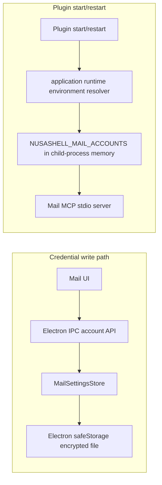

# NusaShell Mail — Read-only Implementation

Status: Implemented first milestone  
Plugin: `plugins/mail`  
Target specification: `docs/mcp/nusashell-mail-mcp-plugin-spec.md`

## Scope

The first milestone deliberately stops at safe mailbox reading. It provides:

- multiple enabled or disabled IMAP/SMTP accounts;
- encrypted host-owned account credentials;
- account inspection and connection tests;
- mailbox and unified-inbox listing;
- message listing, search, MIME parsing, and reading;
- a full-screen three-pane Mail UI;
- the eight MCP tools `accounts`, `account_get`,
  `account_test`, `mailboxes`, `inbox`, `messages`,
  `search`, and `read`.

Sending, drafts, flag changes, move/delete operations, attachment downloads,
background IDLE synchronization, OAuth, POP3, and JMAP are not implemented in
this milestone.

The Mail surface keeps the three-pane correspondence desk on wide windows. On
narrow windows it uses an account rail plus either the message list or reading
pane, with the reader taking the full width on very small screens. Account rows
expose a visible **Edit** action; the account editor also owns deletion. Gmail
presets and authentication failures state that Google App Passwords are
required instead of accepting a regular account password.

## Runtime and credential flow



The public account shape includes `hasCredential` but never the credential
itself. Passwords and app passwords are not placed in the manifest, renderer
state, plugin metadata, WebSocket events, tool schemas, or tool results. A
blank password while editing preserves the existing encrypted credential.

Saving or deleting an account restarts the Mail MCP process so its in-memory
configuration changes atomically from the user's perspective.

## Upstream

The service separation and mail behavior were adapted from
[`codefuturist/email-mcp`](https://github.com/codefuturist/email-mcp) at
revision `99ce431aa81dd4cafc2879bd35b6ee3acd0f2d74`. The pinned source,
upstream license, and adaptation notes live in
`plugins/mail/UPSTREAM.md`, `LICENSE.upstream`, and
`THIRD_PARTY_NOTICES.md`.

NusaShell's UI, broker integration, account IPC contract, credential store,
tool names, bounded result shapes, and tests are project-specific.

## Development

The root development and build commands compile the standalone Mail MCP bundle
before starting or packaging Electron:

```bash
make dev
pnpm build
```

Focused verification:

```bash
pnpm --filter @nusashell/example-mail test
pnpm --filter @nusashell/example-mail typecheck
pnpm --filter @nusashell/example-mail build
```

The browser-only fixture at
`plugins/mail/tests/browser-harness.html` supplies non-secret fake
data for responsive and accessibility checks. It is not used by the packaged
plugin.

## Security boundaries

- TLS or STARTTLS is mandatory for configured IMAP and SMTP endpoints.
- Certificate verification defaults to enabled.
- Mail source reads are bounded before MIME parsing, and returned text is
  truncated to an explicit limit.
- Message content is untrusted input. Plain messages render as text. HTML
  alternatives render inside a dedicated sandboxed document with scripts,
  forms, connections, nested frames, plugins, and media disabled. HTTPS/data
  images and inline presentation styles are allowed inside that document with
  referrer information suppressed; the document receives no shell bridge.
- The MCP surface exposes no arbitrary protocol command, raw credential, or
  write operation.

Before adding send, delete, or mutation tools, define a visible approval
policy and audit events rather than extending this read-only contract in
place.
