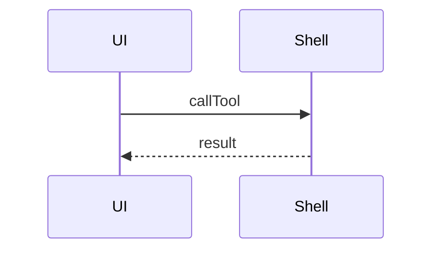
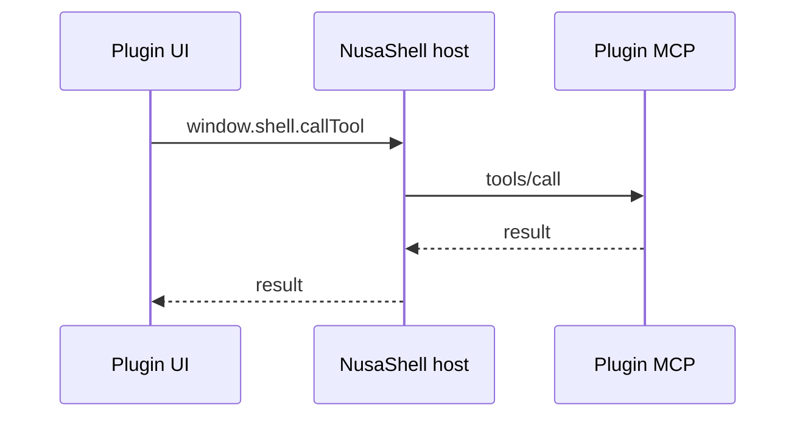
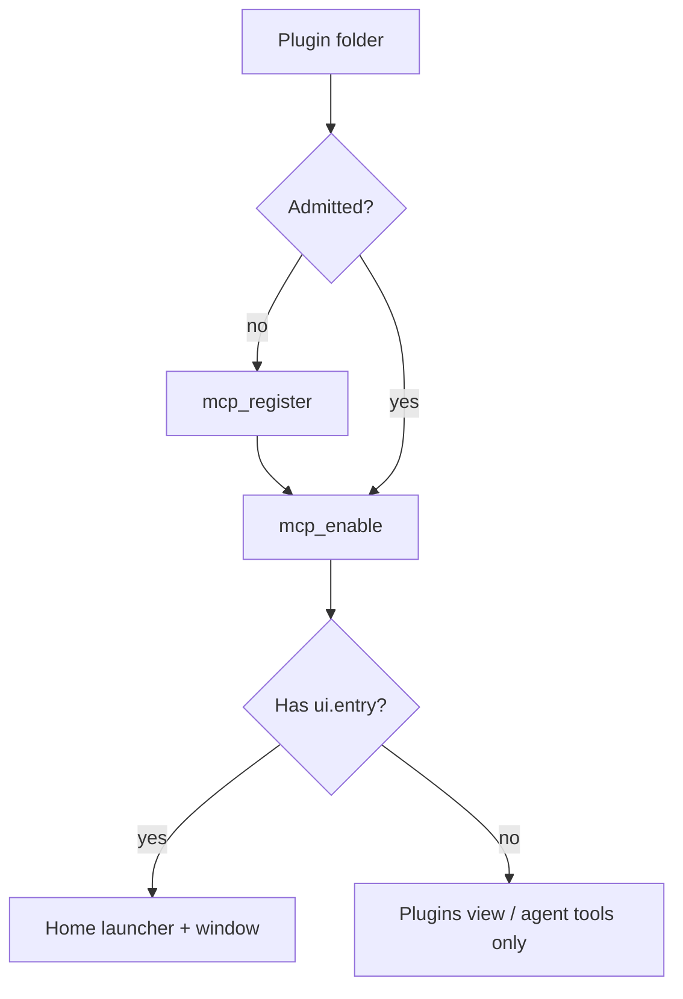
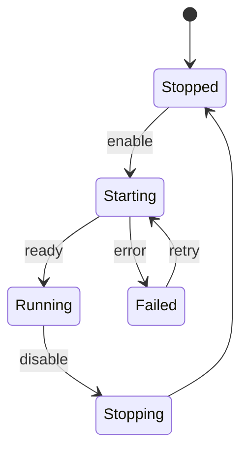
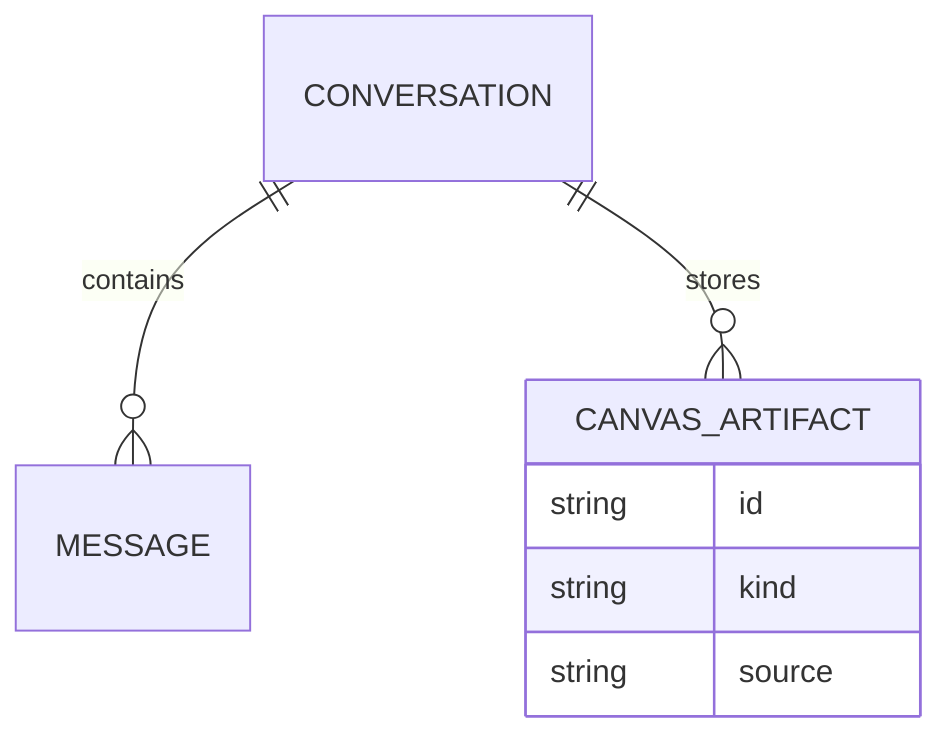
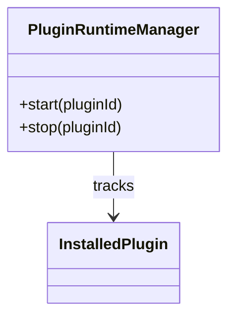

# Mermaid diagram workflow

Use Mermaid when a **structure, sequence, or relationship** is clearer as a
diagram than as a long prose list. In NusaShell, put the diagram in a fenced
code block tagged `mermaid` so Agent Canvas auto-renders it inline.

Diagram type names below follow Mermaid’s official sample gallery
([mermaid.live](https://mermaid.live) / Mermaid docs). Prefer one focused
diagram over many tiny ones.

## When to emit a diagram

Emit a `mermaid` fence when **any** of these is true:

- The user asks how something flows, who calls whom, or what happens next.
- You are explaining a pipeline, decision tree, lifecycle, or architecture.
- A schema / ownership / dependency map would prevent a misread.
- A schedule, share, or chronology is the point of the answer.

Skip Mermaid when:

- A short bullet list or table is enough.
- The answer is a single fact, config value, or command.
- You would need more than ~30 nodes — summarize, then offer a zoomed-in diagram.
- The visual must be **dynamic or interactive** — use HTML (or static SVG) instead.

## When to use HTML instead of Mermaid

Mermaid compiles to **static** SVG. If the user needs something Mermaid cannot
express well, emit a fenced `html` (or `htm`) canvas block:

- Interactive widgets: tabs, toggles, filters, expandable panels, forms.
- Custom layouts or visuals that are not a Mermaid diagram type.
- Lightweight animations or click-driven demos (inline script/style only).
- Mini tools or calculators embedded in the reply.

Agent Canvas auto-renders HTML inline in a sandboxed iframe (`allow-scripts`, no
`allow-same-origin`) with a CSP that denies remote origins in v1 — keep scripts
and styles **inline**; do not load CDN scripts, remote fonts, or external images.
**Sidebar** opens the drawer; **Show source** hides the inline preview and shows
a scrollable source block (about 10 rows).

Use a fenced `svg` block when you need a **static** custom drawing (icons,
annotated shapes) that is still not Mermaid.

Prefer Mermaid when a standard diagram type fits; prefer HTML only when dynamics
or custom UI matter.

## Fence format (Agent Canvas)

Always use the language tag `mermaid` on the **same line** as the opening fence
(not on the next line):

````markdown

````

Wrong (will still be recovered by the shell, but prefer the form above):

````markdown
```
mermaid
flowchart LR
  A-->B
```
````

Keep diagrams small, label edges, and avoid opaque `rect rgb(...)` fills in
sequence diagrams (they can hide arrows). Prefer `TD`/`TB` for hierarchies and
`LR` for pipelines.

## Choose a diagram type

Ask: **What is the primary thing I need the reader to see?**

| If you need to show… | Prefer | Keyword |
| --- | --- | --- |
| Steps, branches, decisions, pipelines | Flowchart | `flowchart` |
| Ordered messages between actors/services | Sequence | `sequenceDiagram` |
| Types, fields, inheritance / composition | Class | `classDiagram` |
| Tables / entities and cardinality | Entity Relationship | `erDiagram` |
| Modes and transitions (UI, jobs, plugins) | State | `stateDiagram-v2` |
| Hierarchical brainstorm / topic map | Mindmap | `mindmap` |
| High-level software context / containers | C4 | `C4Context` (or Container/Component) |
| System blocks and connections | Architecture / Block | `architecture-beta` / `block-beta` |
| Schedule with tasks and durations | Gantt | `gantt` |
| Branch / merge history | Git | `gitGraph` |
| Cause → effect fishbone | Ishikawa | `ishikawa-beta` |
| Board columns and cards | Kanban | `kanban` |
| Packet / bit layout | Packet | `packet-beta` |
| Part-of-whole shares | Pie | `pie` |
| 2×2 priority / risk matrix | Quadrant | `quadrantChart` |
| Multi-axis radar scores | Radar | `radar-beta` |
| Requirements and links | Requirement | `requirementDiagram` |
| Flow quantities between nodes | Sankey | `sankey-beta` |
| Dated milestones | Timeline | `timeline` |
| Nested folder / file tree | TreeView | `treeView` |
| Nested size / hierarchy of magnitude | Treemap | `treemap-beta` |
| UX stages with scores | User Journey | `journey` |
| Overlapping set membership | Venn | `venn-beta` |
| Strategy value-chain maps | Wardley | `wardley-beta` |
| Numeric X/Y series | XY | `xychart-beta` |

When two types fit, pick the more specific one (sequence beats flowchart for
request/response; ER beats class for database tables).

## NusaShell-shaped examples

### Sequence — brokered tool call

Use when explaining iframe → shell → MCP (never peer-connect):



### Flowchart — install / enable path

Use for decision pipelines (headed vs headless, register vs enable):



### State — plugin runtime

Use for lifecycle modes (`stopped` → `starting` → `running` → …):



### ER — conversation canvas artifacts

Use when modeling persisted entities:



### Class — domain objects (sketch)

Use for OOP / package boundaries, not runtime call order:



### Gantt / Timeline — rollout plan

Use for “when”, not “how systems talk”.

### Pie / Quadrant / XY — quantitative

Use only when numbers or relative shares are the point; otherwise prefer text.

## Reliability notes for Agent Canvas

- Canvas runs **Mermaid 11** with `securityLevel: 'strict'` and compiles to static SVG.
- Stick to stable types first: **flowchart, sequence, class, er, state, gantt,
  pie, journey, gitGraph, mindmap, timeline, C4, requirement, sankey, quadrant,
  xychart**. Beta gallery types (`architecture-beta`, `ishikawa-beta`,
  `venn-beta`, `wardley-beta`, `packet-beta`, `radar-beta`, `treemap-beta`,
  `treeView`, …) may fail to render; if they do, fall back to flowchart/sequence
  and keep the source visible via **Show source**.
- **Flowchart edge labels:** quote any label that contains `[]`, `()`, `{}`, `#`,
  or HTML, otherwise Mermaid treats those characters as shape tokens and fails:

  ````markdown
  ```mermaid
  flowchart LR
    A -->|"pluginIds: []"| B
    B -->|"foo(bar)"| C
    C -->|"a<br/>b"| D
  ```
  ````

  Prefer `<br/>` for line breaks inside labels (not raw newlines).
- Agent Canvas may **auto-quote** risky unquoted flowchart edge labels at render
  time so a common slip still draws; **Show source** still shows the original
  fence. Prefer correct quoted syntax in the first place.
- One diagram per fence. Add a one-line caption in prose above or below the fence.
- Do not put secrets, tokens, or absolute home paths with private usernames in
  diagrams.

## Quick decision checklist

1. Is a diagram worth it? If not, use prose.
2. Pick the type from the table (specific > generic).
3. Emit one ` ```mermaid ` fence with a short caption.
4. Keep ≤ ~20–30 nodes; offer a second diagram for a deeper slice if needed.
